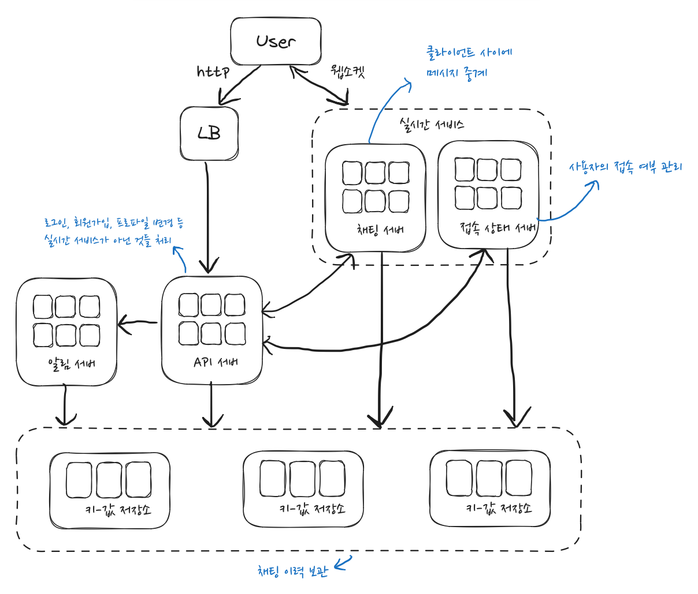

## 1단계 - 문제 이해 및 설계 범위 확정

- 1:1 채팅 앱 or 그룹채팅 앱? 둘 다 지원
- 모바일 앱 or 웹 앱? 둘 다 지원
  - 하나의 계정으로 **여러 단말** 동시 접속 가능
- 트래픽 규모? **DAU 5천만명** (\* DAU: Daily Active User)
- 그룹 채팅 인원 제한? **최대 100명**까지
- 중요기능? 1:1 채팅 / 그룹 채팅 / **사용자 접속상태** 표시
- 텍스트 메시지만 가능
- 메시지 길이 제한? 100,000자 이하
- 종단 간 암호화(end-to-end-encryption) 지원 여부? X
- 채팅 이력 보관 기간? 영구적

## 2단계 - 개략적 설계안 제시 및 동의 구하기

### 1. 어떤 통신 프로토콜을 사용할 것 인가?

- 채팅 메시지 보내는 과정
  - 보내는 사람 -> 채팅서버 -> 받는 사람
- 여기서
  - 보내는 사람 -> 서버 : HTTP 프로토콜을 사용해도 됨 (실제로 초기에는 HTTP를 사용)
  - 하지만, 서버 -> 받는사람, **이 때는 어떻게 해야하는가?**

#### 서버 -> 클라이언트(수신자)로 메시지를 보내기 위한 기법들

1. 폴링 - 클라이언트가 주기적으로 서버에게 새 메시지가 있는지 물어본다
   - (클라: 새 메시지 있어? -> 서버: 없어 -> 클라: 새 메시지 있어? -> 서버: 없어 -> ...)
   - ☹️ 답해줄 메시지가 없는데도 서버 리소스를 써야한다. (불필요한 자원 낭비)
2. 롱폴링 - 폴링을 좀 더 길게 (새 메시지가 반환되거나 타임아웃 될 때까지) 유지
   - ☹️ 송신 클라이언트와 수신 클라이언트가 같은 채팅 서버에 접속되지 않을 수도 있다
     - (👀 연결된 서버가 아닌 다른 서버로 이미 메시지가 보내져 있을 수도 있다는 말?)
   - ☹️ 서버 입장에서 클라이언트와 연결이 끊어졌는지 아닌지 알 수가 없다
   - ☹️ 여전히 불필요한 자원 낭비는 폴링과 동일하다
3. **웹소켓** - 서버가 클라이언트에게 비동기 메시지를 보낼 때 가장 보편적으로 사용하는 기술
   - 웹소켓으로 한번 맺어진 연결은 **영구적**이며 **양방향**이다
     - 한번 연결하고 서버 -> 클라로 비동기로 메시지 전송 가능
   - 방화벽 있는 환경에서도 잘 동작
     - 80(HTTP)이나 443(HTTPS) 기본 포트를 그대로 사용하기 때문에

=> 전송, 수신 클라이언트 모두 웹소켓으로 통일

#### 🖐️웹소켓

- Socket

  - `<protocol, IP address, port number>`로 정의된다
    - `protocol`: 어떤 시스템이 다른 시스템과 통신을 원활하게 수용하도록 해주는 통신 규약, 약속
    - `ip`: 전 세계 컴퓨터에 부여된 고유 식별 주소
    - `port`: 한 호스트에서 네트워크 통신을 하고 있는 프로세스를 식별하기 위해 사용된 값
    - 인터넷 상에 존재하는 각 port를 유니크하게 식별하기 위한 주소
  - **각 socket은 인터넷 상에서 고유하다**

- HTTP 통신 vs SOCKET 통신
  - HTTP 통신
    - client 요청이 있을 때만 sever가 응답하고 원하는 정보 전송 - **단방향 통신**
    - 서버로부터 응답 받은 후 바로 연결 종료 (실시간 연결 x)
  - SOCKET 통신
    - sever, client가 특정 port를 통해 **실시간**으로 **양방향 통신**
      - ex) 실시간 동영상 스트리밍, 온라인
    - sever, client가 계속 연결 유지

### 2. 개략적 설계안

#### 채팅 시스템 주요 part 3

1.  무상태 서비스 (stateless)
    - 전통적인 요청/응답 서비스
    - ex) 로그인, 회원가입, **서비스 탐색**, 사용자 프로파일 등
      - - 서비스 탐색: 클라이언트가 접속할 채팅서버의 DNS 호스트명을 알려주는 역할
    - 무상태 서비스는 로드밸런서 뒤에 위치
2.  상태유지 서비스 (stateful)
    - 상태 유지가 필요한 서비스
    - ex) 채팅 서비스
      - 각 클라이언트가 채팅 서버와 각각의 독립적인 네트워크 연결을 유지하기 때문
      - 보통 클라이언트는 서버가 살아 있는 한 다른 서버로 연결을 변경하지 않는다.
3.  제3자 서비스 연동
    - ex) 푸시 알림

#### 추가적으로 고려할 부분들

- 규모 확장성
  - 대량의 트래픽을 처리해야 하므로 여러대의 서버를 가져야 함
  - 얼마나 많은 접속을 동시에 할 수 있는지 따져봐야 함
- 저장소

#### 저장소

- 어떤 데이터베이스를 쓰느냐 결정하려면 데이터의 유형과 읽기/쓰기 연산의 패턴을 따져봐야함
  - 채팅 시스템이 다루는 2가지 데이터 타입
    1. 일반적인 데이터 - 사용자 프로파일, 설정, 친구 목록 등 => 관계형 DB에 보관
    2. 채팅 이력 => 키-값 저장소에 보관
- 채팅 이력의 특징?
  - 데이터가 엄청 많다 (facebook,왓츠앱 - 매일600억게의 메시지 처리)
  - 사용자는 최근에 주고받은 메시지를 위주로 본다
  - 하지만 검색이나 필터링 기능은 사용한다 => 특정 메시지로 점프 가능해야 함
  - 1:1 채팅앱의 경우 읽기:쓰기 비율은 대략 1:1
- 키-값 저장소를 사용하는 이유?
  - 수평적 규모 확장이 쉽다
  - 데이터 접근 지연시간이 낮다
    - 관계형 데이터베이스는 롱 테일(long tail)을 잘 처리 못함
      - long tail? 80%의 '사소한 다수'가 20%의 '핵심 소수'보다 뛰어난 가치를 창출한다는 이론 (파레토 법칙과 반대되는 이론)
      - 👀 왜지?
      - 인덱스가 커지면 데이터 무작위 접근을 처리하는 비용이 커진다
  - [NoSQL 데이터가 빠른 이유](https://youtu.be/i_vmkaR1x-I?si=rVfy8ZELB0-pgXfC)
    - 👀 다시봐야지

#### 데이터 모델

- 1:1 채팅을 위한 메시지 테이블
  - Primary Key - message_id
    - 메시지 순서도 정할 수 있게 해야함
    - 두 메시지가 동시에 만들어 질수도 있기 때문에 created_at로 순서를 정할 수 없다
- 그룹 채팅을 위한 메시지 테이블
  - (channel_id, message_id)의 복합키를 기본키로 함
- 메시지 ID
  - 고유해야함, 정렬 가능해야 함
  - RDBMS라면 auto_increment가 있지만 NoSQL은 보통 없음
  - 대안
    - 전역적 64-bit 순서 번호 생성기
    - 지역적 순서 번호 생성기 - ID는 같은 그룹안에서만 유니크해도 충분함

## 3단계 - 상세 설계

### 1. 서비스 탐색

- 클라이언트에게 가장 적합한 채팅 서버를 추천 (클라이언트 위치, 서버 용량 기반)
  - 👀 아파치 주키퍼 같은 오픈 소스 사용
- 사용 가능한 모든 채팅 서버를 여기 등록시켜두고 클라이언트가 접속하려할 때 가장 적합한 서버를 선택해서 알려준다

### 2. 메시지 전달 흐름

- 1:1 채팅 메시지 처리 흐름
- 소규모 그룹 채팅 메시지 처리 흐름
  - 메시지 동기화 큐
    - 받는 사람별로 메시지 동기화 큐가 있고, 새로운 메시지가 왔는지 확인하려면 이 큐를 확인한다.
    - 그룹이 크지 않은 경우 ㄱㅊ, 사용자가 많다면 똑같은 메시지를 각각의 큐에 복사하는게 바람직하지 않다
- 여러 단말 사이의 메시지 동기화
  - (휴대폰, 태블릿 사이의 메시지 동기화)
  - cur_max_message_id라는 변수로 가장 최신 메시지 ID를 추적함

### 3. 사용자 접속 상태 표시

- 사용자 A가 실시간 서비스 사이에 웹소켓 연결이 맺어지면, 접속 상태 서버는 A의 값을 `{status: online, last_active_at: 현재타임스탬프 }` 로 바꾼다
- 로그아웃하면 status가 offline으로 바뀜
- 인터넷 접속이 원활하지 않은 경우??
  - 접속이 끊길 때마다 매번 오프라인 상태가 되는 것은 비효율적이다
    - ex) 잠깐 터널을 지나가는 경우 -> online/offline 깜빡깜빡?
  - 박동 검사를 통해 문제 해결
    - 클라이언트가 주기적으로 박동 이벤트를 접속상태 서버로 보내게 한다
    - 이때 주기적으로 이벤트를 받으면 online으로 판단하고, 임의의 초 동안 (예를들어 30초 안에) 이벤트가 안오면 offline으로 판단한다.
- 상태 정보 전송
  - 발행-구독 모델을 사용
  - 친구관계 마다 채널이 있음
    - 그룹 크기가 작을 때만 효과적
    - (그룹 크기가 커진다면 접속 상태를 수동으로 갱신하는 등 다릅 방법을 찾아야한다)

## 4단계 - 마무리

- 추가 논의
  - 채팅에 미디어 지원
  - 종단 간 암호화
  - 캐시
  - 로딩 속도 개선 - 분산 네트워크
  - 오류처리
