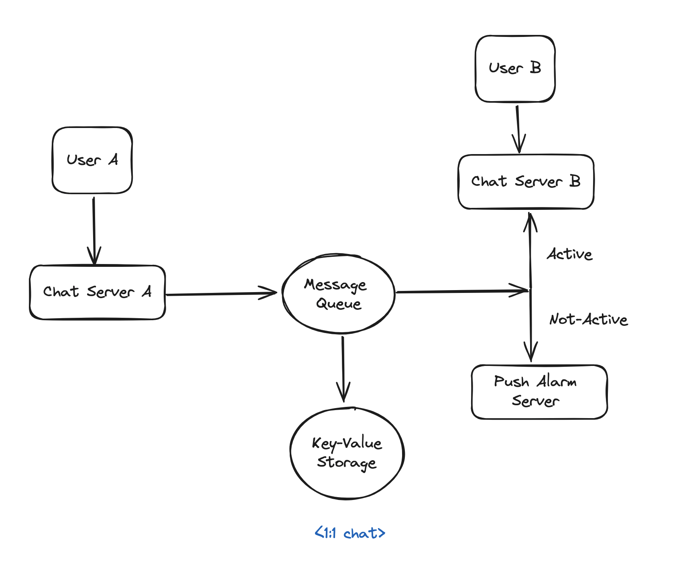
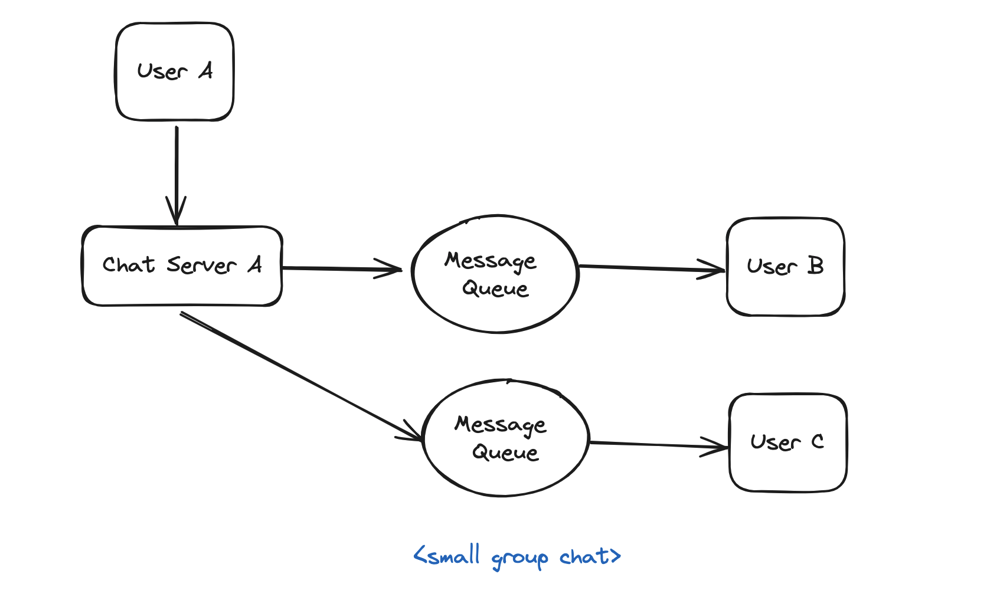
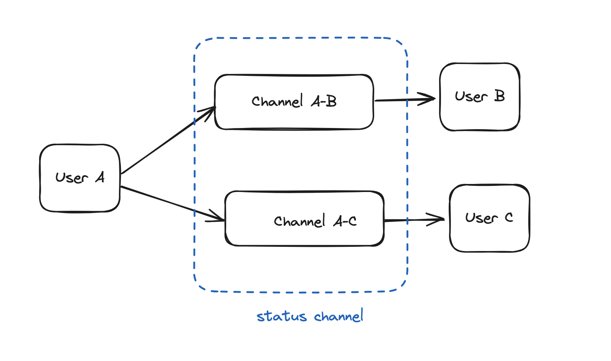

# 채팅 시스템 설계

## 상세 설계

### 1:1 채팅

- 상황
    `사용자 A`:
    - 채팅서버 A로 메시지 전송
    - 채팅서버 A는 메시지를 동기화 큐에 전송
    `사용자 B`:
    - 사용자 B가 접속 중인 경우, 메시지를 채팅서버 B로 전송
    - 사용자 B가 접속 중이지 않은 경우, 메시지를 푸시 알림 서버로 전송
        - 이 때 사용자 B가 채팅서버 B와 맺고 있는 웹소켓 연결을 활용

- 메시키 큐의 역할
  - 메시지 송신/수신 프로세스를 decoupling해주는 buffer component로 활용
  - 메시지 트래픽이 갑자기 늘어났을 때 메시지 retry 로직 구현이 용이해짐

### 소규모 그룹 채팅
- 상황
  - 각 사용자 별로 메시지 동기화 큐가 있어 송신된 메시지가 수신함 즉 메시지 동기화 큐에 각각 복사됨
    - 새로운 메시지가 왔는지 확인하려면 본인 메시지 동기화 큐만 확인하면 되는 방식임  
    - 그룹 채팅에 참여하는 사용자가 많아진다면 사용자 수만큼 메시지 동기화 큐를 관리해야 하기 때문에 확장성이 떨어짐
  - 각 사용자의 메시지 동기화 큐는 여러 사용자로부터 오는 메시지를 받을 수 있어야 함
  
- 개선 방안
  - `Publish/Subscribe Model`
    - **Publisher**: The sender publishes a message once to a topic.
    - **Subscribers**: Recipients subscribe to the topic and receive messages published to it. This model decouples the sending and receiving processes, allowing for scalable message distribution.
  - `Message Broker Enhancement`
    - **Apache Kafka**: Utilizes partitioning and replication to ensure high availability and fault tolerance. It can handle large volumes of data and distribute it efficiently to many consumers.
    - **RabbitMQ**: Supports complex routing capabilities and can efficiently manage message delivery to multiple consumers.

### 상태 정보 전송
- publish/subscribe model으로 접속 상태 정보를 전송하는 방식

