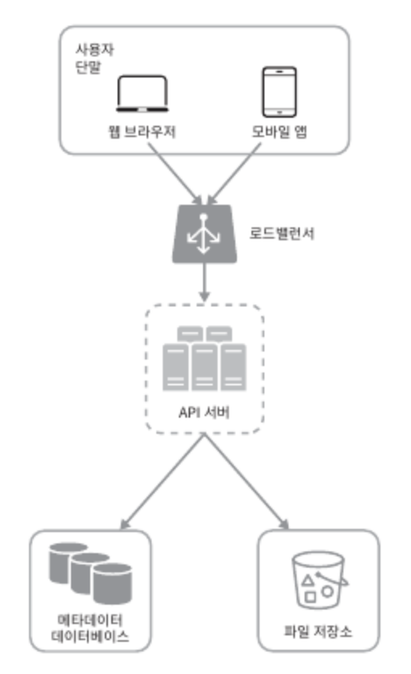

# 구글 드라이브 설계

### 기능 요구사항

- 파일 업로드/다운로드
- 파일 동기화
  - 갱신이력 조회
- 알림

#### 초기 설계

- 파일 업로드/다운로드를 처리할 웹 서비 1대
- 사용자 데이터, 로그인 정보, 파일 정보를 저장할 데이터베이스
- 파일을 저장할 공간 1TB

### API

#### 파일 업로드 API

- 단순 업로드: 파일 크기가 작을 때
- 이어 올리기: 파일 크기가 크고 네트워크 문제로 업로드가 중단될 가능성이 높은 경우

#### 파일 다운로드 API

- path: 다운로드할 파일 경로

#### 파일 갱신 히스토릴 API

- path: 갱신 히스토리를 가져올 파일의 경로
- limit: 히스토리 길이의 최대치

### 1대 서버 운영의 제약

업로드되는 파일이 많아지면 Disk Full 이슈 발생

대안

- 데이터를 샤딩하여 여러 서버에 분산하여 저장
- Cloud 서비스 사용
  - AWS S3
  - S3의 경우 다중화 기능도 제공 (지역 내, 지역 외)

한 대의 서버에서 모든 요청을 받는 경우 부하가 심해지고 장애가 나면 서비스 이용 불가

대안

- 로드밸런서 추가하여 네트워크 트래픽을 분산
  - 장애가 발생하면 해당 서버를 제외하고 나머지 서버로 요청을 보낸다.
- 데이터베이스 서버 분리

### 동기화 충돌 문제

- 흥미로운 과제다.. 참고문헌을 읽어보아라..?

### 블록 저장소

파일을 클라우드 서버에 업로드하는 로직을 처리하는 서버. 하나의 파일을 여러 블록으로 나누고 각 블록은 압축되어 적은 용량을 가지며 독립적인 객체로보고 고유한 해시값을 갖는다. 이 해시값은 데이터베이스에 저장된다.

동작방식

1. 파일은 작은 블록들로 분할한다.
2. 각 블록을 압축한다.
3. 블록을 암호화한다.
4. 클라우드 저장소로 보내 저장한다.

이 과정에서 수정된 블록만 클라우드 저장소로 업로드하여 네트워크 대역폭 사용량을 줄일 수 있다. (수정된 부분을 확인하는건 어떻게..?)

### 알림 서비스

파일이 수정되었음을 다른 클라이언트에게 알리는 용도로 사용. 이를 통해 파일의 일관성을 높게 유지할 수 있다.

- 롱 폴링: 서버와 연결을 유지하다가 응답을 받거나 타임아웃이 발생하면 연결은 끊고 새로운 요청을 보내 응답을 유지하는 방식
- 웹소켓: 클라이언트 <-> 서버 사이에 지속적인 통신 채널을 제공. 양방향 통신 가능

### 저장소 공간 절약

파일 갱신 이력을 보관하기 위해 파일의 여러 버전을 데이터센터에 저장할 필요가 있다. 모든 버전을 자주 백업하게되면 저장용량이 너무 빨리 소진될 가능성이 있다.

- 중복 제거: 해시 값을 비교하여 중복된 파일 블록을 제거
- 지능적 백업:
  - 한도 설정: 보관해야할 파일의 버전 개수에 상한을 둔다.
  - 중요한 버전만 보관: (어떻게 판단..?)
- 자주 쓰이지 않는 데이터 아카이빙 저장소로 이동: 아카이빙 저장소를 이용료가 더 저렴하다!
