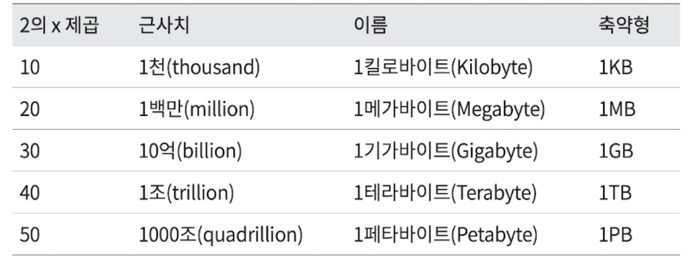
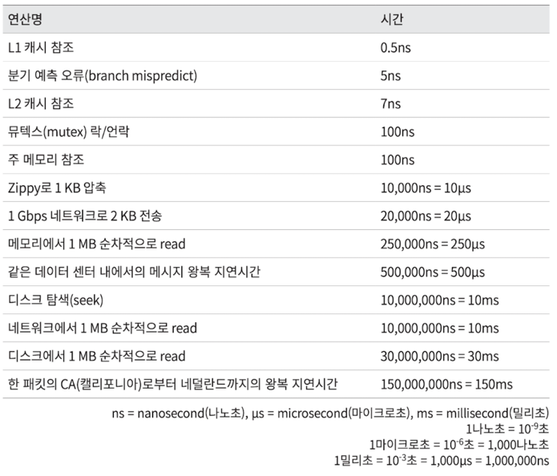
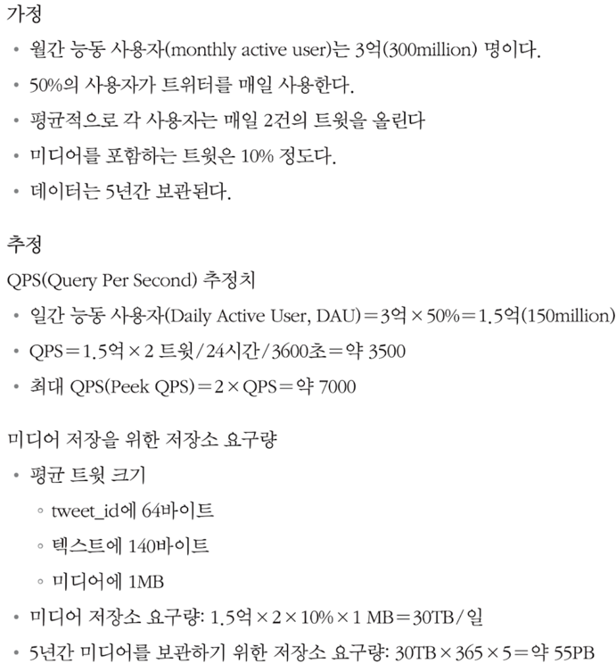

# 1장. 사용자 수에 따른 규모 확장성

## 단일서버

웹 - 앱 - 데이터베이스 - 캐시 등이 한 서버에서 동작

1. 사용자는 도메인 이름(api.mysite.com)을 이용하여 웹사이트에 접속. 도메인 이름을 DNS에 질의하에 IP 주소로 변환.
  2. DNS 조회 결과로 IP 주소가 반환됨
  3. IP주소로 HTTP 요청이 전달됨
  4. 요청을 받은 웹 서버는 HTML페이지나 JSON 형태의 응답 반환

## 데이터베이스

- 관계형 데이터베이스, 관계형 데이터관리 시스템 (RDMBS)
  - ex. MysSQL, 오라클 데이터베이스, PostgreSQL
  - 자료를 테이블과 열, 컬럼으로 표현
  - SQL 사용하여 테이블에 있는 데이터를 관계에 따라 조인하여 합칠 수 있음
- 비관계형 데이터베이스 (NoSQL)
  - ex. DynamoDB, CouchDB
  - 키-값 저장소, 그래프 저장소, 칼럼 저장소, 문서 저장소
  - 조인 연산 지원하지 않음

웹/모바일 트래픽 처리용도의 서버(웹 계층)와 데이터베이스용 서버(데이터 계층)를 분리

- 독립적 확장 추구

**비-관계형(NoSQL) 데이터베이스가 좋은 선택일 수 있는 경우**

- 아주 낮은 응답 지연시간 필요
- 다루는 데이터가 비정형 데이터인 경우
- 데이터를 직렬화/역직렬화 할 수만 있으면 되는 경우
- 아주 많은 양의 데이터를 저장할 필요가 있는 경우

## 수직적 규모 확장 vs 수평적 규모 확장
#### 스케일 업(Scale up)
* CPU, Memory 등 고사양의 자원을 추가하는 행위이다.
    * 장점
        * 단순하다.
    * 단점
        * 한 대의 서버에 CPU나 메모리를 무한대로 증설할 수는 없으므로 한계가 있다.
        * 다중화를 통한 HA, Failover를 할 수 없다.

#### 스케일 아웃(Scale out)
* 새로운 서버를 새로 증설하여 수평적으로 자원을 추가 확장하는 행위이다.
* 트래픽에 따라 유동적으로 서버를 증설하고, 줄임으로써 비용을 효율화 시킬 수 있다.
* 다중화를 통한 HA, Failover를 통해 비즈니스 안정성을 높일 수 있다.
* 유동적으로 늘어나고 줄어드는 서버에 대해서 사용자의 트래픽을 분산 시켜주어야 하는데, 로드밸런서를 통해 가능하다.

#### 로드밸런서
* 로드밸런서는 여러 서버들에게 트래픽을 골고루 분배하여 부하를 분산시켜준다.
* 구성에 따라 각 L7, L4, L3, L2 레이어에서 로드밸런싱을 할 수 있다.
* 클라이언트는 서버에 직접 접근하는게 아니라 로드밸런서로 접근하고 로드밸런서는 해당 요청을 서버로 서빙한다.
* 특정 서버에서 문제가 발생하면 로드밸런서는 해당 서버로의 트래픽을 차단하고 다른 서버로 트래픽을 몰아줌으로써 고가용성을 확보할 수 있다.

#### 데이터베이스 다중화
* 데이터베이스 다중화는 Source-Replica(구. Master-Slave) 구조이다.
    * Source 서버에서는 Write 연산을 한다.
    * Replica 서버에서는 Read 연산을 한다.
* 대부분의 애플리케이션은 Write 보다 Read 연산의 비중이 훨씬 크다.
    * 다중화를 통해 서버 트래픽의 부하에 따라 Replica 서버 구축이 가능하다.
* 데이터베이스를 여러 지역에 분산시켜 놓음으로써 자연재해, 전쟁 등으로부터 하나의 서버가 파괴되더라도 데이터를 보존할 수 있다.
* 다중화를 통해 Source 서버에 장애가 발생하더라도 Replica 서버 중 하나를 선출하여 Source 서버로 승격 시켜서 장애 시간을 최소화 시킬 수 있다.
* 네트워크나 서버의 상황에 따라 복제 지연이 발생할 수 있다.

## 캐시

캐시 계층은 데이터가 잠시 보관 되는 곳 → 메모리를 사용

- 좋은 성능 (빠름)
- 휘발성 → 영속성 보관 데이터가 의존해서는 안됨
- 만료 및 일관성 유지, 장애 등을 생각해서 사용되어야 함
    - 캐시 메모리 크기, Evition 정책 등도 설정 필요

## 콘텐츠 전송 네트워크 (CDN, Content Delivery Network)

정적 콘텐츠 저장 → 지리적 분산 서버 네트워크

* CDN은 정적 콘텐츠를 캐싱해두고 전송하는 데 쓰이는, 지리적으로 분산된 서버의 네트워크이다.
* 이미지, 비디오, CSS, Javascript 파일 등을 캐시할 수 있다.
* CDN 은 사용자가 웹사이트에 방문하면, 그 사용자에게 가장 가까운 CDN 서버가 정적 콘텐츠를 전달한다.
    * 만약 사용자에게 필요한 정적 콘텐츠가 CDN에 없다면 서버에 요청하여 가져온 다음, CDN에 적재하여 다음 요청부터는 CDN을 통해서 정적 콘텐츠를 제공받을 수 있다.
* 콘텐츠 업데이트를 위해 CDN에 저장된 콘텐츠를 무효화 시키고 싶다면 아래와 같은 방법으로 제거할 수 있다.
    * CDN 서비스 사업자가 제공하는 API를 이용하여 콘텐츠 무효화
    * 컨텐츠의 다른 버전을 서비스하도록 오브젝트 버저닝(object versioning)을 이용

- CDN 사용 시, 고려 사항

  - 비용: 제3 자에 의해 운영 → CDN 들어가고 나가는 데이터 전송 양에 따라 요금 지불
  - 적절한 만료시간 설정: 만료기간이 중요한 콘텐츠의 경우, 만료시점 설정이 중요함
  - CDN 장애 대처방안: CDN 죽었을 때, 어떻게 동작하는가에 대한 대책 필요
  - 콘텐츠 무효화: 만료되지 않은 콘텐츠라도 무효화 할 수 있는 방안 필요

## 무상태 웹 계층

웹 계층으로 수평적으로 확장 → 상태 정보(ex] 사용자 세션)를 웹 계층에서 제거

- 세션은 같은 클라이언트로부터의 요청이 항상 같은 서버로 전송되어야 함

상태 정보가 필요한 경우, 공유 저장소(shared storage)를 사용

- 웹 서버로부터 물리적으로 분리

## 데이터 센터

2개의 데이터 센터 사용 → 장애 없으면 사용자는 가장 가까운 데이터 센터로 안내됨

- 지리적 라우팅 (geoDNS-routing/geo-routing) 사용
- 만약 장애나면, 장애가 나지 않은 데이터 센터로 연결

이런 것처럼 다중 데이터 센터를 고려하는 경우, 몇 가지 고려해야하는 사항이 있음.

- 트래픽 우회: 올바른 데이터 센터로 트래픽을 보내는 법. GeoDNS 같이.
- 데이터 동기화: 센터마다 별도의 데이터베이스면, 동기화를 어떻게 할 것인가. 보편적으로 다중화함.

## 메시지 큐

메시지 큐에 일단 보관된 메세지는 소비자가 꺼낼 때까지 안전히 보관되는 특성

- 메시지의 무손실 및 비동기 통신 지원

메시지 큐를 사용하면 서버간 ‘느슨한 결합’을 이룰 수 있음

- 규모확장성 향상, 안정적 애플리케이션 구성 가능

물론, 메시지 큐를 사용하게되면 관리자가 관리해야할 컴포넌트가 늘어나는 것.

## 로그, 메트릭 그리고 자동화

로그

- 에러로그 모니터링 → 시스템/어플리케이션의 오류 및 문제 찾기 위함
- 검색 및 조회 기능 지원해야 편하다.

메트릭

- 시스템의 현재 상황 파악 , 사업 현황에 관한 유용한 정보
- 호스트 단위 메트릭: CPU, 메모리, 디스크 I/O 등
- 종합 메트릭: 데이터베이스 계층 성능, 캐시 계층 성능
- 핵심 비즈니스 메트릭: 일별 능동 사용자(DAU), 수익 등

자동화

- CI/CD
- 빌드/테스트/배포 절차 자동화 → 개발 생산성 향상

## 데이터베이스 규모 확장

수직적 확장 → 고성능 자원 증설

- 한계 존재
- 여전히 단일이기에 SPOF 무시할 수 없음
- 비용 비쌈

수평적 확장 → 샤딩

- 한계 없음
- 데이터를 어떻게 분산시키는가가 가장 중요함.
- 데이터 분산을 고려하다보니 시스템 자체가 복잡해지고, 여러 문제가 발생함.

# 2장. 개략적인 규모 추정

면접 질문 : 시스템 용량이나 성능 요구사항을 개략적으로 추정해보라.

> 구글의 시니어 펠로 제프 딘
> "개략적인 규모 추정은 보편적으로 통용되는 성능 수치상에서 사고 실험을 행하여 추정치를 계산하는 행위로서, 어떤 설계가 요구사항에 부합할 것인지 보기 위한 것"

## 2의 제곱수
최소 단위는 1바이트, 8비트로 구성됨
ASCII 문자 하나가 차지하는 메모리 크기는 1바이트

## 응답지연 값

## 가용성에 관계된 수치들
고가용성 : 시스템이 오랜 시간 동안 지속적으로 중단 없이 운영될 수 있는 능력을 지칭하는 용어 (%)
100%는 시스템이 한 번도 중단된 적이 없었음을 의미
SLA : 서비스 사업자가 보편적으로 사용하는 용어로, 서비스 사업자와 고객 사이에 맺어진 합의

### 예) 트위터 QPS\

### 팁
- 근사치를 활용한 계산
- 가정을 적어두라. 나중에 살펴볼 수 있도록
- 단위를 붙여라.
- QPS, 최대 APS, 저장소 요구량, 캐시 요구량, 서버 수 등 추정