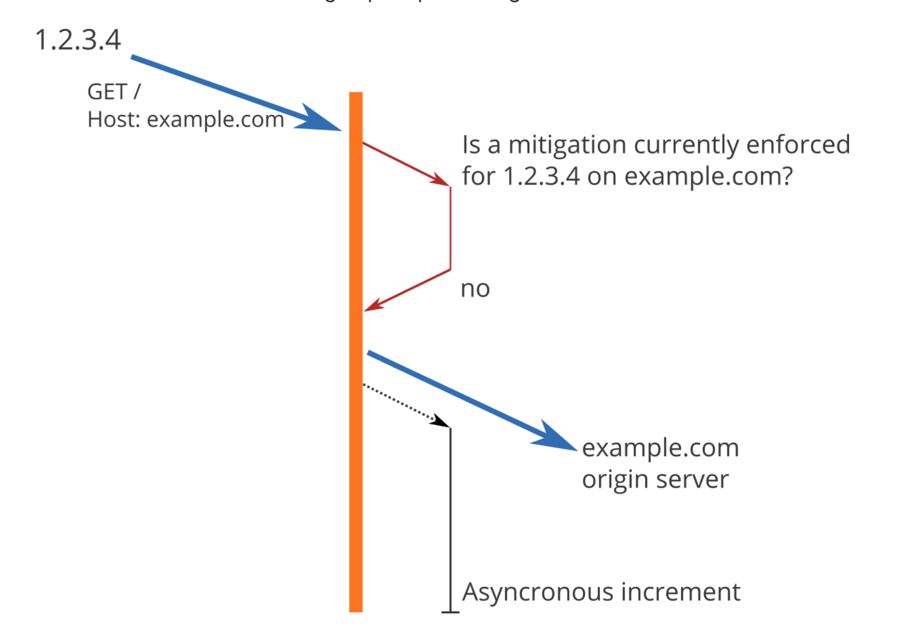

## 문제 이해 및 설계 범위 확정

- 가정 1 - 서버측 API를 위한 장치 설계
- 가정 2 - 다양한 형태의 제어 규칙 (throttling rules)를 정의할 수 있는 유연한 설계
- 가정 3 - 대규모 요청을 처리할 수 있는 설계
- 가정 4 - 분산 시스템 환경에서 동작 가능해야 함
  - 하나의 처리율 제한 장치를 여러 서버나 프로세스에서 공유 가능해야 함 (분산형 처리율 제한)
- 가정 5 - 사용자의 요청이 처리율 제한 장치에 의해 걸러진 경우 이 사실을 사용자에게 공지해야 함
  - 예외처리에 해당

## 처리율 제한 알고리즘

- 토큰 버킷 (token bucket)
  - https://dev.to/satrobit/rate-limiting-using-the-token-bucket-algorithm-3cjh
  - https://kendru.github.io/javascript/2018/12/28/rate-limiting-in-javascript-with-a-token-bucket/
  - https://www.nginx.com/blog/rate-limiting-nginx/
  - 장점
    - 구현이 쉽고 메모리 사용도 효율적
    - 짧은 시간 내에 집중되는 트래픽 처리도 토큰 개수가 충분하다면 용이한 편
  - 단점
    - 버킷 크기, 토큰 공급률 2개의 인자값을 적절히 튜닝하는 것이 어려움
- 누출 버킷 (leaky bucket)

  - 특징
    - 요청 처리율이 고정되어 있고 FIFO로 많이 구현함
    - 버킷 크기: 큐 사이즈
    - 처리율 (outflow rate): 지정된 시간에 몇 개의 항목을 처리할지 지정하는 값
  - 장점
    - 고정적인 요청 처리율로 안정적인 출력 (stable outflow rate)이 필요한 경우 적합함
  - 단점
    - 짧은 시간 내에 트래픽이 몰리는 경우 큐에 오래된 요청들이 쌓이게 되어 최신 요청들이 버려지는 문제가 있음
    - 버킷크기, 처리율 2개의 인자값을 적절하게 튜닝하는 것이 어려움

- 고정 윈도우 카운터 (fixed window counter)

  - 특징
    - `타임라인 = 고정된 간격의 윈도 (window) * 윈도우마다 처리 가능한 카운터 (counter)`
  - 단점
    - 트래픽이 몰리는 타임라인에 제한된 처리 요청 개수보다 더 많은 요청이 처리될 수도 있음

- 이동 윈도우 로깅 (sliding window log)

  - 특징
    - 요청 타임스탬프는 캐시 (ex. redis, sorted set)에 저장하여 추적함
    - 새 요청의 타임 스탬프를 로그에 추가하고, 로그의 크기가 허용치보다 같거나 작으면 요청을 시스템에 전달하고 그렇지 않으면 요청 처리를 거부함
      - 요청 처리되지 않은 타임 스탬프들은 버려지지 않고 윈도우 안에 포함될 경우 만료된 타임스탭프들을 지우고 새로운 요청으로 처리됨

- 이동 윈도우 카운터 (sliding window counter)
  - https://blog.cloudflare.com/counting-things-a-lot-of-different-things/
  - 특징
    - 고정 윈도 카운터 알고리즘 + 이동 윈도 로깅 알고리즘을 결합한 형태
    - 현재 윈도우에 몇 개의 요청이 들어있는지 파악하기 위해 직전 1분 간의 요청수에 대해 가중치를 두어서 계산함
      - `현재 1분간의 요청 수 + 직전 1분 간의 요청 수 X 이동 윈도와 직전 1분이 겹치는 비율`
  - 장점
    - 고정 윈도 카운터 알고리즘처럼 트래픽이 몰렸을 때 처리율 한도를 넘기게되는 이슈가 없음
    - 이동 윈도우 로깅 알고리즘처럼 요청 타임스팀프를 일일히 다 저장하고 매번 비교하지 않아도 됨
    - 직전 처리율에 대한 추정치지만 높은 정확률을 보임

## 개략적인 아키텍처

- 클라이언트가 요청을 보내오면 처리율 제한 미들웨어는 카운터가 한도에 도달했는지 확인 후 한도에 도달하지 않았을 경우에만 origin server로 요청을 보냄
- 카운터는 메모리 기반 저장장치 Redis에 저장해 관리할 수 있음
  - INCR: 메모리에 저장된 카운터의 값을 +1
  - EXPIRE: 카운터에 타임아웃 값 설정하고 설정된 시간이 지나면 카운터는 자동으로 삭제됨

## 상세 설계

시스템 확장 시 고려해야 할 사항들

- 경쟁 조건
  - lock 적용
  - [Lua Script](https://engineering.linecorp.com/ko/blog/atomic-cache-stampede-redis-lua-script)
- 동기화 이슈
  - sticky session 적용
  - Redis와 같은 중앙 집중형 데이터 저장소를 활용한 설계 적용
- 성능 최적화
  - 여러 데이터센터를 지원하는 경우 latency를 줄이는 것이 중요하기 때문에 대부분의 클라우드 서비스의 경우 세계 곳곳에 edge server를 심어 놓음
  - 최종 일관성 모델을 통환 데이터 동기화 (데이터 일관성)
- 모니터링
  - 트래픽이 급증할 때 처리율 제한 장치가 효율적으로 동작하고 있는지 확인 필요
    - 채택된 처리율 제한 알고리즘이 효과적인지
    - 정의한 처리율 제한 규칙이 효과적인지
