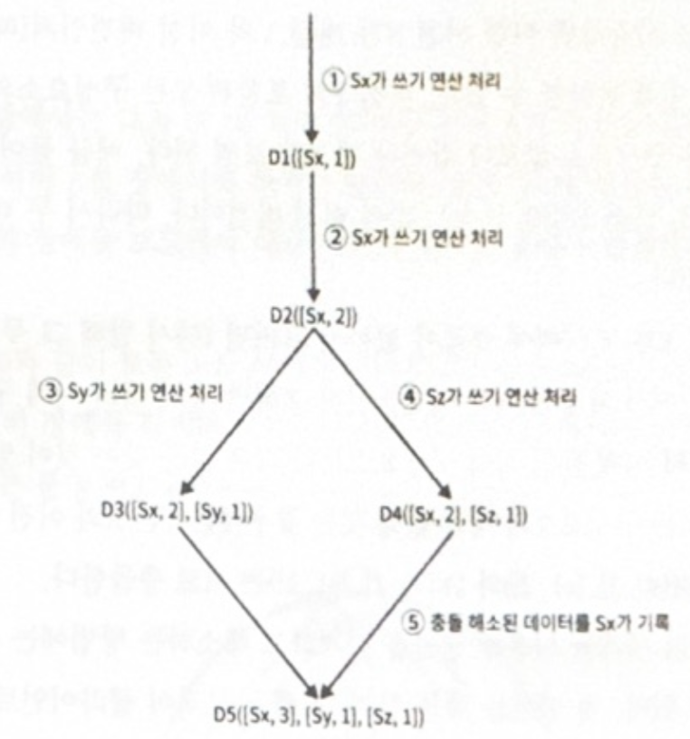
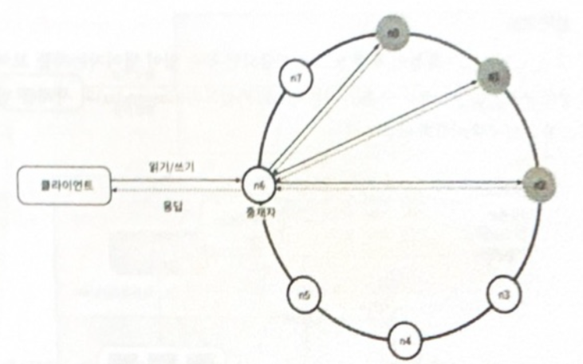
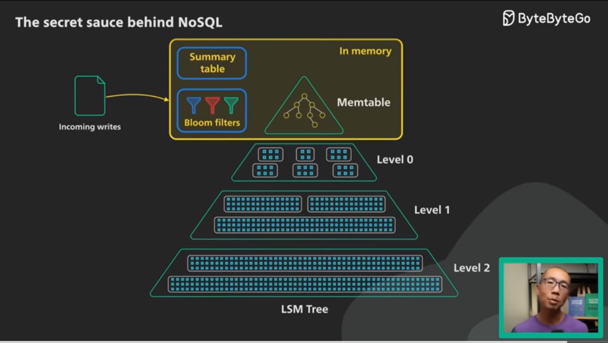

# 6장. 키-값 저장소 설계

## 키-값 저장소 설계

- key-value 쌍으로 데이터를 저장하는 것 (비관계형 DB)
- key는 고유 식별자여야햐고 문자열, 배열, 객체, 해시값 등등으로 가능
- ex) Dynamo, memcached, redis ...

## 문제 이해 및 설계 범위 확정

- 읽기, 쓰기 & 메모리 사용량 사이의 균형
- 데이터의 **일관성**과 **가용성** 사이의 타협점을 찾는 것이 중요하다
- 요구사항
  - 키-값 쌍의 크기는 10KB 이하
  - 큰 데이터를 저장할 수 있어야 한다
  - 높은 가용성 : 장애가 나도 빨리 응답해야함
  - 높은 규모 확장성 : 트래픽 양에 따라 자동으로 서버 증설, 삭제
  - 데이터 일관성 수준은 조정가능해야 함
  - 응답 지연시간 짧아야 함

## 단일 서버 키-값 저장소

- 한대의 서버만 사용하는 키-값 저장소라면 그냥 메모리에 해시테이블로 저장해도 됨
- 속도는 빠르겠지만, 결국 용량에 한계에 부딪힐 것
- 개선 책
  - 데이터 압축
  - 자주 쓰는 데이터만 메모리에 올리고 나머지는 디스크에 저장
- 쨌튼, 결국 규모가 커져서 대량의 데이터를 저장하려면 분산 해야됨

## 분산 키-값 저장소

- 키-값을 여러 서버에 분산 시키키는 것

## CAP 정리

- CAP를 모두 만족시킬 수 없다는 정리! (하나는 포기해야됨,,)
  - Consistency(데이터 일관성) : 어떤 노드에서 접근해도 동일한 데이터를 봄
  - Availability: 가용성 - 어떤 노드에 장애가 발생해도 항상 응답 받을 수 있음
  - Partition Tolerance: 파티션 감내 - 파티션이 생기더라도 시스템이 계속 돌아갸아함
    - 파티션: 두 노드 사이에 통신장애가 발생함을 의미
- CA / **AP** / **CA** 시스템이 있음
  - 근데 네트워크 장애는 불가피 -> 사실상 CA는 존재하지 x
- 예시
  - 노드 세개 n1, n2, n3 있는데, n3에 장애 발생한다면?
    - n1, n2에 기록된 내용은 n3에 전달 x
    - n3에 기록되었지만 n1, n2에 전달되지 않았다면 n1, n2 데이터는 stale한 상태
  - CP 시스템 (일관성이 중요)
    - 서버 사이의 불일치 피하기 위해 n3이 고쳐질 때까지 n1, n2 중단
  - AP 시스템 (가용성이 중요)
    - n1, n2가 오래된 데이터를 반환하더라도 읽기 허용

## 시스템 컴포넌트

- 키-값 저장소 구현에 사용될 핵심 컴포넌트들 및 기술들

## 1 . 데이터 파티션

- 모든 데이터를 서버 하나에 저장 x, 나눠서 저장
- 이 때 고려할 부분?
  1.  데이터를 여러 서버에 고르게 분산
  2.  노드가 추가, 삭제 될 때 데이터 이동을 최소화
- 안정 해시로 위 문제 개선 -> 규모 확장 자동화, 다양성 (서버 용량에 맞게 가상노드 수 조정)

## 2. 데이터 다중화 (replication)

- 높은 가용성 & 안정성을 위해 데이터를 N개 서버에 복제
- N=3인 경우 key0이 s1, s2, s3에 저장되는데,
  - 이때 가상노드를 사용한다면 동일한 물리서버가 아니도록 조심해야 한다
  - 또 데이터 사본은 다른 데이터 센터에 보관해야함 (정전, 자연재해 등 이슈를 동시에 겪을 수 있으므로)
- 

## 3. 데이터 일관성 (consistency)

- 여러 노드의 다중화된 데이터의 동기화 필요
- 정족수 합의 (Quorum Consensus) 프로토콜 -> 읽기/쓰기 연산 모두에 일관성 보장
  - N: 사본 개수, W: 쓰기 연산에 대한 정족수 (W개의 서버로 부터 쓰기 연산 성공 응답 받아야함), R: 읽기 연산에 대한 정족수 (R개의 서버로 부터 읽기 연산 성공 응답 받아야함)
  - 요구되는 일관성 수준에 따라 W, R, N 값을 조정한다.
    - R = 1, W = N : 빠른 읽기 연산에 최적화
    - W=1, R = N : 빠른 쓰기 연산에 최적화
    - W + R > N : 강한 일관성이 보장됨 (보통 N=3, W=R=2)
    - W + R <= N : 강한 일관성이 보장되지 않음
- 일관성 모델
  - 강한 일관성: 무조건 최근 데이터 반환
  - 약한 일관성: out-of-date 데이터를 반환할 수도
  - 결과적 일관성: 약한 일관성이지만, 결국 갱신 결과가 모든 사본에 반영 됨

## 4. 일관성 불일치 해소 (inconsistency resolution)

- 데이터를 다중화하면 가용성은 높아지지만 일관성이 깨질 가능성이 높아짐
- 버전잉 (versioning), **벡터시계**(vector clock)
- 백터시계는 [서버, 버전]의 순서쌍
  - [Si, vi]가 있으면 vi 증가
  - 없으면 새 항목 [Si, 1] 생성
- ![[Pasted image 20231216234559.png]]
- 벡터 시계 단점
  - 충돌 감지 및 해소로직은 클라이언트에 들어가야 하므로 클라이언트 구현이 복잡해진다
  - [서버, 버전] 순서쌍 개수가 굉장히 빨리 늘어남 (-> 그래서 오래된 순서쌍을 제거해야함 (다이나모 DB))

## 5. 장애처리

- 장애 감지
  - 보통 두 대 이상의 서버가 똑같이 서버 A의 장애를 보고해야 해당 서버에 실제로 장애가 발생했다고 간주함
  - 멀티캐스팅 -> 손쉽지만 노드가 늘어날 수록 비효율적
  - **가십 프로토콜** (gossip protocol)
    - 각 노드는 멤버십 목록 유지
    - 멤버십목록: 멤버 ID - 박동 카운터 쌍의 목록
    - 각 노드는 주기적으로 자신의 박동 카운터를 증가 -> 무작위 노드에게 자신의 박동카운터를 보냄 -> 받은 노드가 멤버십 목록 갱신
    - 어떤 멤버의 박동 카운터 값이 지정된 시간 동안 갱신되지 않으면 장애로 봄!
- 장애 해소
  - 일시적 장애 처리 - s2가 죽으면 임시로 s3이 처리
  - 영구 장애 처리
    - 반-엔트로피(anti-entropy) 프로토콜 구현 -> 사본 동기화
      - 일관성이 망가진 상태를 탐지하고 전송 데이터 양을 줄이기 위해 **머클(Merkle) 트리** 사용
        - 균등 분포 해시 함수 적용해서 버킷별로 해시값 계산 (쭉 위로 해시값 계산)
        - 이진 트리 탐색 ~> 해시값이 일치하면 두 서버가 같은 데이터를 갖고, 다르면 다른 데이터를 갖는 것. 쭉쭉 내려가서 다른 데이터를 갖는 버킷 찾음 -> 그 버킷들만 동기화
  - 데이터 센터 장애 처리

## 6. 시스템 아키텍처 다이어그램

- 클라이언트 : 키-값 저장소가 제공하는 api인 get(key), put(key,value)와 통신
- 중재자 : 클라이언트에게 키-값 저장소에 대한 프락시(proxy) 역할
- 노드는 안정해시, 해시링 위에 분포 / 시스템은 완전히 분산 / 데이터 다중화 / 모든 노드가 같은 책임을 지므로 SPOF는 존재하지 않음

## 7. 쓰기 경로 (write path)

1. 쓰기 요청이 커밋로그 파일에 기록
2. 데이터가 메모리 캐시에 기록
3. 메모리가 가득차거나 사전에 정의된 임계치에 도달하면 메모리가 아닌 디스크에 있는 **SSTable**(Sorted-String Table)에 기록됨 (SSTable: 키-값 순서쌍을 정렬된 리스트 형태로 관리하는 테이블)

## 8. 읽기 경로 (read path)

1. 메모리에 데이터가 있으면 반환
2. 없으면 블룸 필터(Bloom Filter)로 SSTable에 키가 보관되어 있는지 확인
3. SSTable에서 데이터 가져와 클라이언트에 반환

---

## 같이 보기 좋은 내용들

- [The Secret Sauce Behind NoSQL : LSM Tree](https://youtu.be/I6jB0nM9SKU?si=CXh5ZWhTj8d7EWf0)

- [Bloom Filters](https://youtu.be/V3pzxngeLqw?si=iNQR3EgeBp9V-IK2)
