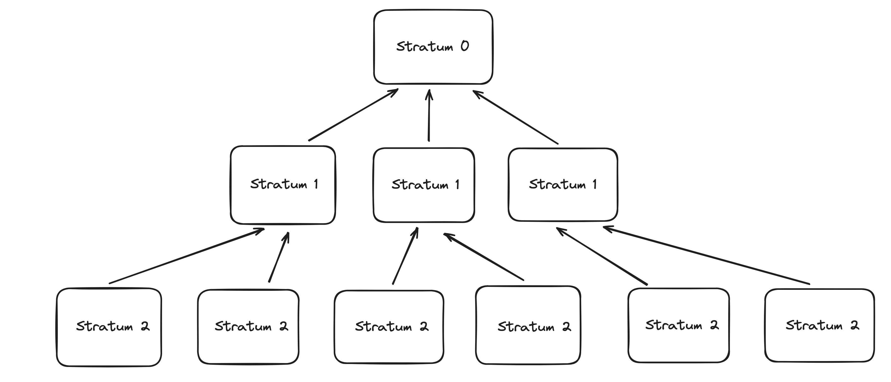
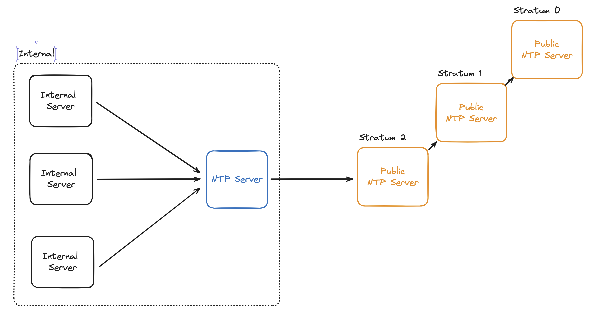

# NTP (Network Time Protocol)

- 네트워크로 구성된 환경에서 운영되는 **시스템들의 시간을 동기화하기 위한 규약**

## NTP 서버를 사용하는 이유

- 내부 네트워크 환경으로 구성되어 있는 물리서버 간의 시간을 동일하게 구성하여 신뢰성을 높이고자 할때 사용
- 유지보수 또는 보안적인 이유
  - 서로 통신을 하는 A,B 서버가 서로 다른 시간이 설정되어 있다면, 특정 서버에 이슈가 발생했을때 서로 다른 시간으로 인해 로그 분석에 어려움이 생김
- 인프라 관련 감사 항목에도 포함되어 있음

> 서버 시간이 달라지는 이유

- 각 서버가 설치된 시점과 환경이 다름
- 서버가 설치된 물리장비의 위치가 매우 멀리 떨어진 경우
  - 수년이 지난 후 시간이 차이나는 경우가 있음 (중력의 영향.. 중력이 강한 곳일 수록 약한 곳에 비해 시간이 빠르게 흐른다)

## NTP 서버 작동 방식

시간을 동기화하기 위해서는 매우 정확한 시계가 장착된 서버가 필요하다. 보통은 원자시계 혹은 GPS가 연동된 시계가 장착된 서버를 말한다.

이러한 장비는 매우 비싸기 때문에 모든 서버에 설치할 수 없고, 해당 서버에 모든 요청이 몰린다면 서버의 과부하가 매우 심해진다.

그래서 계층구조로 NTP 서버를 다시 구성하여 사용한다.

### NTP 서버 계층구조

보통 Stratum 0 ~ 15 까지 사용되고 15 이상의 경우 신뢰할 수 없다고 판단이 된다.

NTP 클라이언트가 상위 NTP 서버를 바라보며 시간을 동기화하게 된다.

### NTP 서버 구축

NTP 프로토콜은 UDP 123 Port를 사용하기 때문에 해당 포트를 열어주지 않으면 사용할 수 없다.

직접 Public 네트워크 망에 바로 연결하게되면 보안상 좋지 못하기 때문에 보통은 내부망 내의 NTP 서버를 구축하여 사용한다.

### 참고자료

NTP 서버 설정 - https://whitewing4139.tistory.com/132
