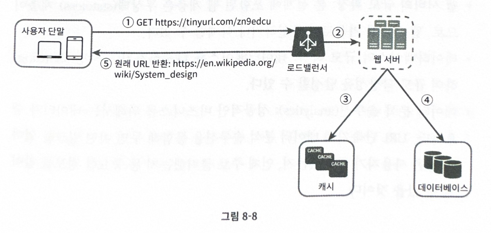

# 8. URL 단축기 설계

## URL 단축기란?

긴 URL을 짧은 단축 URL로 변환
ex) https://www.systeminerview.com/q=chatsystem&c=loggedin&v=v3&l=long
-> https://tinyurl.com/y7ke-ocwj

1. URL 단축: 주어진 긴 URL을 짧게 줄인다
2. URL 리디렉션(redirection): 축약된 URL로 HTTP 요청이 오면 원래 URL로 안내
3. 높은 가용성, 규모 확장성, 장애 감내

## 1단계 - 문제 이해 및 설계 범위 확정

## 요구사항

- 트래픽: 매일 1억개의 단축 URL 생성 가능
- 길이: 짧을 수록 좋음
- 0-9, a-z, A-Z만 사용 가능
- 삭제나 갱신은 지원 x

### 개략적 추정

- 쓰기 연산: 매일 1억개의 단축 URL 생성
  - 초당 쓰기 연산: 1억/(24 \* 3600) = 1160
- 읽기 연산: 초당 11,600회 (읽기:쓰기 = 10:1)
- URL 단축 서비스를 10년간 운영한다면 , 1억 _ 365 _ 10 = **3650억 개**의 레코드를 보관 가능해야 함
- 축약 전 URL의 평균길이는 100
  -> 10년 동안 필요한 저장용량: 3650억 \* 100바이트 = 36.5TB

## 2단계 - 개략적 설계안 제시 및 동의 구하기

### API 엔드포인트

URL 단축기는 **두 개의 endpoint**를 필요로 한다

1. URL 단축용 엔드포인트 (ex) POST /api/v1/data/shorten)
   - 단축할 URL을 인자로 POST 요청
2. URL 리다이렉션 엔드포인트 (ex) GET /api/v1/shortUrl)
   - 단축 URL에 대해서 HTTP 요청 -> 리디렉션될 원래의 URL 반환

### URL 리디렉션

브라우저에 단축 URL을 입력하면

- RequestURL: https://tinyurl.com/y7ke-ocwj
- Request Method: GET
- Status Code: 301
  Response Headers
- Location: https://www.systeminerview.com/q=chatsystem&c=loggedin&v=v3&l=long

원래 URL을 Location 헤더에 넣어서 301 응답을 반환

#### 301 vs 302

- 301 Permanently Moved
  - 이제 해당 URL에 대한 HTTP 요청 처리는 Location 헤더로 반환된 URL이 해줄 것임!
  - 영구적으로 이전되었으므로 브라우저는 이 응답을 **캐시**한다
    - 추후 같은 URL에 요청을 보내면 브라우저는 **캐시된 원래 URL로 요청**을 보냄 (첫번째 요청만 단축 URL 서버로 보내짐)
- 302 Found
  - 주어진 URL로의 요청이 **일시적으로** Location 헤더가 지정하는 URL에 의해 처리됨
  - 따라서 클라이언트 요청은 **언제나 단축 URL 서버에 먼저 보내진 후** 원래 URL로 리디렉션 됨.
- 서버 부하를 줄이는 것이 중요하면 301, 트래픽 분석이 중요하면 302 사용
- URL 리디렉션을 구현하는 가장 직관적인 방법 = HashTable (원래 URL = HashTable.get(단축 URL))

### URL 단축

- 결국 중요한 것은 URL을 해시 값으로 대응시킬 해시 함수 fx를 찾는 일!
- 해시 함수 요구사항
  - input(입력으로 주어지는 긴 URL)이 다르면 해시값도 달라야 함
  - output(단축 url)은 input(원래 url)으로 복원될 수 있어야 함

## 3단계 - 상세 설계

### 데이터 모델

- 개략적 설계에서는 해시 테이블에 두었지만, 메모리는 유한하고 비쌈
- `<단축 URL, 원래 URL>` 순서쌍을 관계형 DB에 저장하기
- 필요한 칼럼: id, shortURL, longURL

### 해시 함수

- 원래 URL을 단축 URL을 변환하는데 쓰임
- hashValue = 해시 함수가 계산하는 단축 URL 값

#### hashValue 길이

- hashValue의 길이: 7

  - 사용가능한 문자의 개수: 10 (0-9) + 26 (a-z) + 26 (A-Z) = 62개
  - 62^n >= 3650억, n의 최솟값 -> 7

- 해시 함수 구현에 쓰일 기술 두 가지 방법
  1.  해시 후 충돌 해소
  2.  base-62 변환

#### 해시 후 충돌 해소

- CRC32, MD5, SHA-1과 같이 잘 알려진 해시 함수를 이용하는 것이 쉬움
- 그런데 CRC32가 계산한 가장 짧은 해시값조차도 7보다 긺.
- 어떻게 줄일 수 있을까?
  1.  해시 값에서 처음 7개 글자만 이용하기
      - 해시 결과가 충돌할 확률이 높아짐
      - 충돌한다면? 충돌이 해소될때까지 사전에 정한 문자열을 해시값에 덧붙임
        - 이 방법을 쓰면 단축 URL을 생성할 때 한번 이상 데이터베이스를 질의해야 하므로 오버헤드가 크다
        - 이 때, 데이터베이스 대신 **블룸필터**를 사용하면 성능을 높일 수 있다.

#### base-62 변환

- 진법 변환(base conversion)은 URL 단축기를 구현할 때 흔히 사용되는 접근법 중 하나다
- 수의 표현 방식이 다른 두 시스템이 같은 수를 공유해야 하는 경우 유용 (??🤔)
- hashValue에 사용 가능한 문자가 62개이므로 62진법 사용
  - `0-9 -> 0-9`, `10-35 -> a-z`, `36-62 -> A-Z` 로 대응시켜 표현
- 11157 (10진수) 변환 -> 2TX (62진수)

#### 해시 후 충돌 해소 vs base-62 변환

- 해시 후 충돌 해소
  - 단축 URL의 길이가 고정됨
  - 유일성이 보장되는 ID 생성기가 필요하지 않음
  - 충돌이 가능해서 해소 전략 필요
  - ID로부터 단축 URL을 계산하는 방식이 아니니 다음에 쓸 수 있는 URL을 알아내는 것이 불가능
- base-62 변환
  - 가변적 ID 값이 커질수록 단축 URL의 길이가 길어짐
  - 유일성이 보장되는 ID 생성기 필요
  - ID의 유일성이 보장된 후에야 적용 가능한 전략이라 충돌은 아예 불가능
  - ID가 1씩 증가하는 경우 다음에 올 수 있는 단축 URL을 유추 가능 -> 보안상 문제될 수도

### URL 단축기 상세 설계

1. 입력 longURL
2. 입력된 URL이 DB에 있나?
   - 예: DB에서 찾은 단축 URL 반환
   - 아니오: 새로운 ID 생성 -> 생성된 ID를 단축 URL로 변환 -> ID, 단축 URL, 원래 URL을 DB에 저장

- 이 때 ID는 전역적 유일성이 보장되어야함! (7장. 분산 ID 생성기 참고)

### URL 리디렉션 상세 설계

- 쓰기보다 읽기를 자주하므로 캐시를 사용하여 성능 높임
  - 캐시에 `<단축 URL, 원래 URL>` 쌍을 저장

## 4단계 마무리

이외에 더 얘기해보면 좋을 것들

- 처리율 제한 장치
- 웹 서버의 규모 확장
- 데이터베이스의 규모 확장
- 데이터 분석 솔루션
- 가용성
