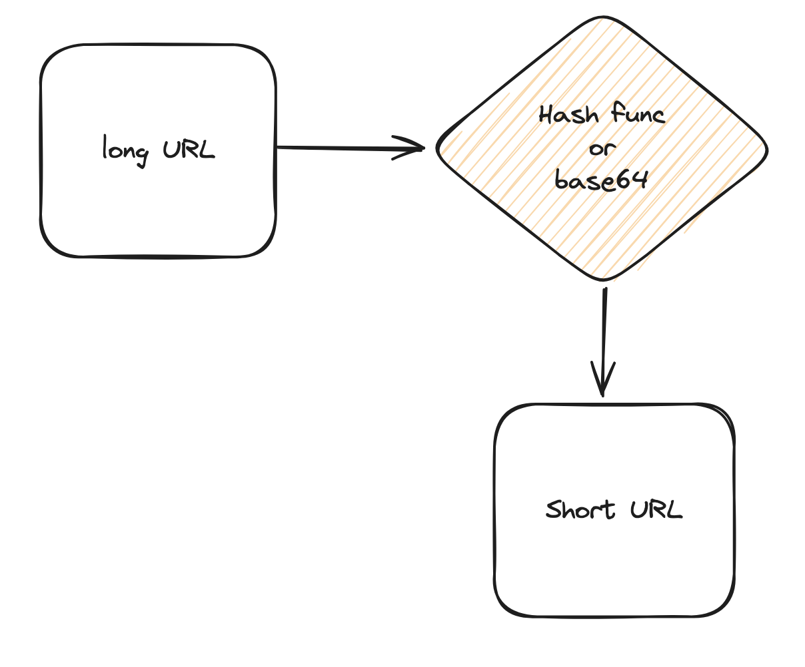
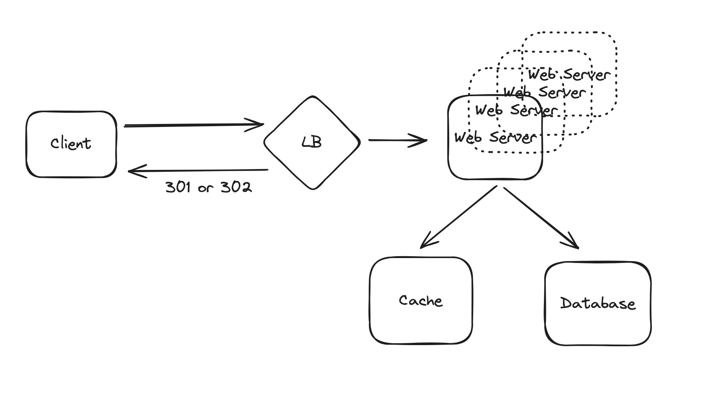

# URL 단축기 설계

`https://example.com/q=chatsystem&c=loggedin&v=v3&l=long` 와 같이 상대적으로 긴 URL을 짧게 만드는 URL 단축기를 설계

## URL 단축기 구조

1. 긴 URL을 전달받는다.
2. Hash 전략 혹은 Base64 변환 전략을 통해 짧은 URL을 반환
3. ID, 긴 URL, 짧은 URL을 DB에 저장

## URL Redirection 구조

1. client URL 접속
2. LB에서 적절한 Web Server로 부하 분산
3. Web Server에서 Cache 조회
4. Cache에서 없으면 Database에서 조회, Cache에 있다면 꺼내서 Client에 301 또는 302 상태코드 반환
5. Database에서 조회한 결과를 Cache에 저장
6. Client에 301 또는 302 상태코드 반환

### etc

이전에 301 코드로 인해서 발생했던 이슈가 있어서 공유..

[문제 상황]

`https://example.com/token=blahblah~` 형태로 접속시 Server에서 token을 파싱하여 적절한 URL로 변환하여 내려주고 있었음.

서버쪽에서 파싱하여 만들어주는 URL에 특정 Query Parameter를 추가하는 작업이 추가됨.
해당 작업이 배포된 이후에도 변경된 URL로 리다이렉트 되지않아서 문제 발생..

[원인]

서버에서 301 상태코드와 location 헤더를 통해 리다이렉션을 구현하고 있었고, 해당 결과가 브라우저 캐시저장소에 캐시되고 있었음.

서버에서 배포가 되었어도 사용자가 한 번 해당 URL에 접근한 경우 브라우저 캐시에 의해 서버로 요청이 가지 않고 이전 URL을 바라보게 됨..

[해결책]

서버쪽 응답 결과에 Cache-Control 헤더에 `no-cache, no-store` 옵션을 추가하여 응답하여 브라우저에서 캐시를 하지않도록 대응.

이미 브라우저 캐시가 된 경우 별다른 해결책이 없다.. 캐시가 만료되기를 기다리거나 문의대응으로 해결

**301과 302 상태코드에 대해서 자세히 알고있었다면 302를 사용하지 않았을까..ㅎ**
