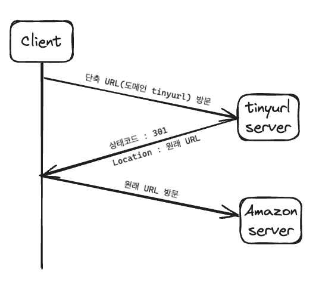
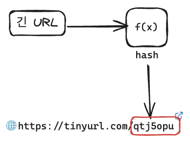
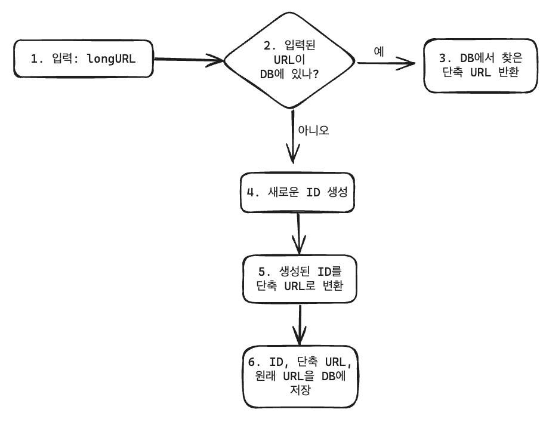
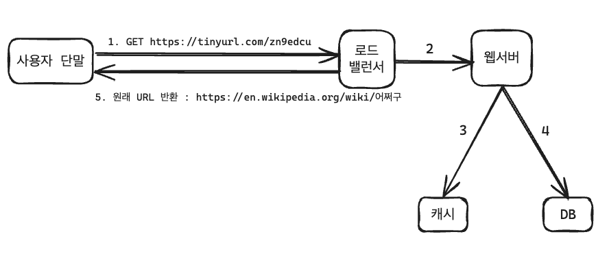

## 1단계. 문제 이해 및 설계 범위 확정

#### 기본적 기능

1. URL 단축 : 주어진 긴 URL을 훨씬 짧게 줄인다.
2. URL 리다이렉션 : 축약된 URL로 HTTP 요청이 오면 원래 URL로 안내
3. 높은 가용성과 규모 확장성, 그리고 장애 감내가 요구됨

#### 개략적 추정

- 쓰기 연산 : 매일 1억 개의 단축 URL 생성
- 초당 쓰기 연산 : 1억(100million) / 24 / 3600 = 1160
- 읽기 연산 : 읽기 연산과 쓰기 연산 비율을 10:1 이라고 하면, 읽기 연산은 초당 11,600회 발생 (1160 X 10 = 11,600)
- URL 단축 서비스를 10년간 운영한다고 가정하면 1억(100million) X 365 X 10 = 3650억(365billion) 개의 레코드를 보관해야 한다.
- 축약 전 URL의 평균 길이는 100이라고 하자.
- 따라서 10년 동안 필요한 저장 용량은 3650억(365bilion) X 100바이트 = 36.5TB이다.

## 2단계. 개략적 설계안 제시 및 동의 구하기

### API 엔드포인트

1. URL 단축용 엔드포인트
   `POST /api/v1/data/shorten`
   - 인자 : `{longUrl}: longURLstring}`
   - 반환 : 단축 URL
1. URL 리다이렉션용 엔드포인트
   `GET /api/v1/shortUrl`
   - 반환 : HTTP 리다이렉션 목적지가 될 원래 URL

### URL 리다이렉션

단축 URL을 받은 서버는 그 URL을 원래 URL로 바꾸어서 301 응답의 Location 헤더에 넣어 반환함.

#### **301 vs 302**

`- 301 Permanently Moved` - 해당 URL에 대한 HTTP 요청의 처리 책임이 영구적으로 Location 헤더에 반환된 URL로 이전되었다는 응답. 영구적으로 이전되었으므로, 브라우저는 이 응답을 캐시(cache)한다. 따라서 추후 같은 단축 URL에 요청을 보낼 필요가 있을 때 브라우저는 캐시된 원래 URL로 요청을 보내게 된다. - 서버 부하를 줄이는 것이 중요할 때 사용. 첫 번째 요청만 단축 URL 서버로 전송될 것이기 때문.
`- 302 Found` - 주어진 URL로의 요청이 '일시적으로' Location 헤더가 지정하는 URL에 의해 처리되어야 한다는 응답. 따라서 클라이언트의 요청은 언제나 단축 URL 서버에 먼저 보내진 후에 원래 URL로 리다이렉션되어야 한다. - 트래픽 분석(analytics)이 중요할 때 사용. 클릭 발생률이나 발생 위치를 추적하는 데 좀 더 유리하기 때문.

#### 해시테이블

URL 리다이렉션을 구현하는 가장 직관적인 방법.
해시 테이블에 <단축 URL, 원래 URL> 쌍을 저장한다고 가정하면 다음과 같은 형태.

- `원래 URL = hashTable.get(단축 URL)`
- 301 또는 302 응답 Location 헤더에 원래 URL을 넣은 후 전송

### URL 단축

단축 URL이 www.tinyurl.com/{hashValue} 와 같은 형태라고 해보자. 중요한 것은 긴 URL을 이 해시 값으로 대응시킬 해시 함수 fx를 찾는 일이다.

이 해시함수는 다음 요구사항을 만족해야 한다.

- 입력으로 주어지는 긴 URL이 다른 값이면 해시 값도 달라야 한다.
- 계산된 해시 값은 원래 입력으로 주어졌던 긴 URL로 복원될 수 있어야 한다.

## 3단계. 상세 설계

### 데이터 모델

해시테이블은 메모리는 유한하고 비싸기 때문에 <단축 URL, 원래 URL>의 순서쌍을 관계형 데이터베이스에 저장하는 것이 좋다.
![[Pasted image 20240123231805.png]]

### 해시 함수

해시 함수는 원래 URL을 단축 URL로 변환하는 데 쓰인다.
hashValue : 해시 함수가 계산하는 단축 URL 값. 이라 하자.

#### 해시 값 길이

hashValue는 [0-9, a-z, A-Z]의 문자들로 구성되기 때문에, 사용할 수 있는 문자의 개수는 10+26+26=62개다. 62^n >= 3650억인 n의 최솟값을 찾아야 한다.
n=7이면 3.5조 개의 URL을 만들 수 있기 때문에 hashValue의 길이를 7로 하자.

#### 해시 후 충돌 해소

긴 URL을 줄이려면, 원래 URL을 7글자 문자열로 줄이는 해시 함수가 필요.
해시 함수인 CRC32, MD5, SHA-1 등을 사용하는데, 이를 사용해도 7보다는 길다.
이를 해결하기 위해 계산 된 해시 값에서 처음 7개 글자만 이용하는데, 그러면 해시 결과가 충돌할 확률이 높아진다.

충돌이 발생하면 충돌이 해소될 때까지 사전에 정한 문자열을 해시값이 덧붙인다.
![[Pasted image 20240123232650.png]]
이 방법을 쓰면 충돌은 해소할 수 있지만 단축 ULR을 생성할 때 한 번 이상 데이터베이스 질의를 해야하므로 오버헤드가 크다. 데이터베이스 대신 `블룸 필터`를 사용하면 성능을 높일 수 있다.

> `블룸 필터`는 어떤 집합에 특정 원소가 있는지 검사할 수 있도록 하는, 확률론에 기초한 공간 효율이 좋은 기술이다.

#### base-62 변환

수의 표현 방식이 다른 두 시스템이 같은 수를 공유하여야 하는 경우에 유용함.
62 진법을 사용하는 이유는 hashValue에 사용할 수 있는 문자 개수가 62개이기 때문.

_11157을 62진수로 변환하면 2TX_

#### 두 접근법 비교

| 해시 후 충돌 해소 전략                                                                   | base-62 변환                                                                                                                |
| ---------------------------------------------------------------------------------------- | --------------------------------------------------------------------------------------------------------------------------- |
| 단축 URL의 길이가 고정됨                                                                 | 단축 URL의 길이가 가변적. ID 값이 커지면 같이 커짐                                                                          |
| 유일성이 보장되는 ID 생성기가 필요치 않음                                                | 유일성 보장 ID 생성기가 필요                                                                                                |
| 충돌이 가능해서 해소 전략이 필요                                                         | ID의 유일성이 보장된 후에야 적용 가능한 전략이라 충돌은 아예 불가능                                                         |
| ID로부터 단축 URL을 계산하는 방식이 아니라서 다음에 쓸 수있는 URL을 알아내는 것이 불가능 | ID가 1씩 증가하는 값이라고 가정하면 다음에 쓸 수 있는 단축 URL이 무엇인지 쉽게 알아낼 수있어서 보안상 문제가 될 소지가 있음 |

### URL 단축기 상세 설계

base-62 변환을 사용한 설계

1. 입력으로 긴 URL을 받는다.
2. DB에 해당 URL이 있는지 확인한다.
3. DB에 있으면 해당 URL에 대한 단축 URL을 만든 적이 있으므로 반환한다.
4. DB에 없으면 해당 URL은 새로 접수된 것이므로 ID를 생성한다. (ID는 DB의 기본키)
5. 62진법 변환을 적용, ID를 단축 URL로 만든다.
6. ID, 단축 URL, 원래 URL로 새 DB 레코드를 만든 후 단축 URL을 클라이언트에 전달한다.

### URL 리다이렉션 상세 설계

로드밸런서의 동작 흐름

1. 사용자가 단축 URL을 클릭한다.
2. 로드밸런서가 해당 클릭으로 발생한 요청을 웹서버에 전달한다.
3. 단축 URL이 이미 캐시에 있는 경우에는 원래 URL을 바로 꺼내서 클라이언트에게 전달한다.
4. 캐시에 해당 단축 URL이 없는 경우에는 DB에서 꺼낸다. DB에 없다면 아마 사용자가 잘못된 단축 URL을 입력한 경우이다.
5. DB에서 꺼낸 URl을 캐시에 넣은 후 사용자에게 반환한다.

## 마무리

추가로 고려할 사항

- 처리율 제한 장치
- 웹 서버의 규모 확장
- DB 규모 확장
- 데이터 분석 솔루션
- 가용성, 데이터 일관성, 안정성
