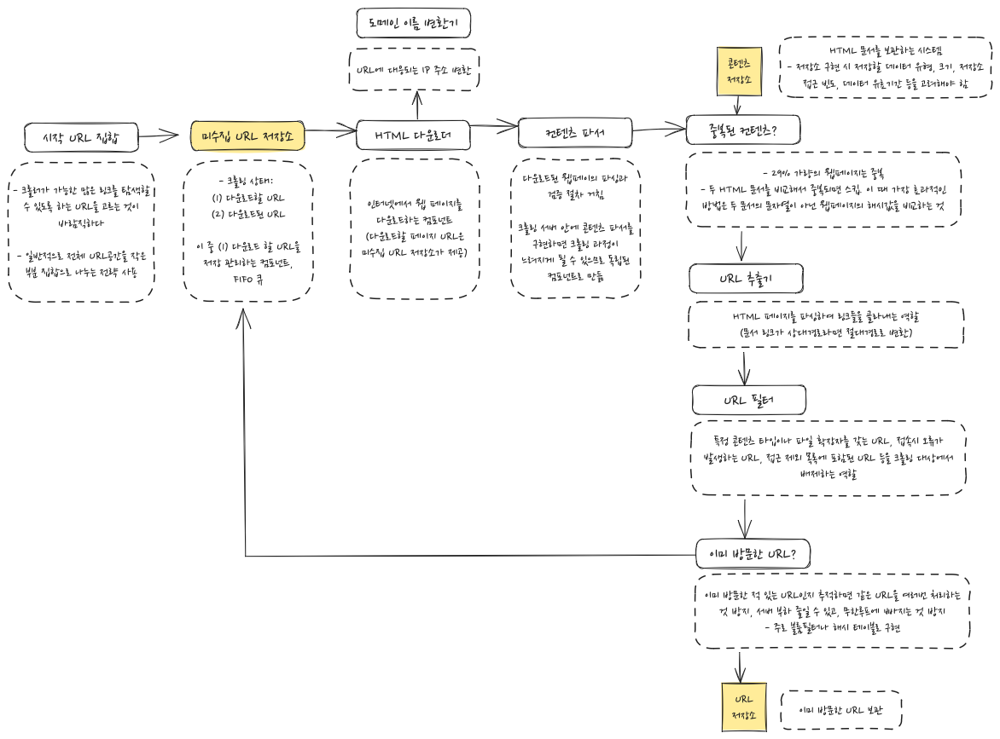

## 웹 크롤러

- 로봇(robot) 또는 스파이더(spider)
- 검색 엔진에서 널리 쓰이는 기술로, **웹에 새로 올라오거나 갱신된 콘텐츠를 찾아내는 것**이 주된 목적
  - 몇 개 웹 페이지에서 시작해서 링크를 타고타서 새로운 콘텐츠 수집

## 크롤러의 다양한 사용

- 검색 엔진 인덱싱 (searching engine indexing)
  - 웹페이지를 모아 **검색 엔진을 위한 로컬 인덱스**를 만듦
  - ex) Googlebot - 구글 검색 엔진이 사용하는 웹 크롤러
- 웹 아카이빙 (web archiving)
  - 나중에 사용할 목적으로 장기보관하기 위해 웹에서 정보를 모으는 절차
  - ex) 미국 국회 도서관, EU 웹 아카이브
- 웹 마이닝 (web mining)
  - 웹 마이닝으로 인터넷에서 유용한 지식을 도출
  - ex) 유명 금융 기업에서 크롤러를 사용해 주주 총회 자료나 연차 보고서를 다운받아 기업의 핵심 사업 방향을 알아냄
- 웹 모니터링 (web monitoring)
  - 인터넷에 저작권이나 상표권이 침해되는 사례 모니터링

## 1단계 - 문제 이해 및 설계 범위 확장

### 웹 크롤러 기본 알고리즘

1. 입력: URL 집합 -> 해당 URL들이 가리키는 모든 웹페이지를 다운로드
2. 다운받은 웹페이지에서 URL들 추출
3. 추출된 URL들을 다운로드할 URL 목록에 추가하고 다시 1부터 반복

### 설계 범위 좁히기

- 주된 용도? 검색 엔진 인덱싱
- 매달 수집할 웹페이지 규모? 매달 10억개의 웹페이지 수집 필요
- 새로 만들어진 웹페이지나 수정된 웹페이지도 고려 필요
- 수집한 웹페이지 저장 기간? 5년
- 중복된 콘텐츠를 갖는 페이지는 무시

### 좋은 웹 크롤러가 만족시켜야 할 속성들

- 규모 확장성 : 웹은 거대하다. 병행성(parallelism) 활용하면 더 효과적으로 웹 크롤링 가능
- 안정성: 잘못 작성된 HTML, 아무 반응 없는 서버, 장애, 악성 코드가 붙은 링크 등에 비정상적인 입력이나 환경에 잘 대응할 수 있어야 함
- 예절: 짧은 시간 동안 너무 많은 요청을 보내면 안된다. (DoS 공격으로 볼수도)
- 확장성: 새로운 형태의 콘텐츠를 지원하기 쉬워야 함

### 개략적 규모 측정

- 매달 10억개 웹페이지 다운로드
  - QPS = 10억 / 30일 / 24시간 / 3600초 = **대략 400페이지/초**
  - (QPS: Queries Per Second)
  - 최대 QPS = 2 x QPS = 800
- 웹페이지 평균 크기는 500k로 가정
  - 10억 페이지 x 500k = 500TB/월
  - 5년 -> 500TB x 12개월 x 5년 = **30PB의 저장용량**이 필요

## 2단계 - 개략적 설계한 제시 및 동의 구하기

1. 시작 URL들을 미수집 URL 저장소에 저장
2. HTML 다운로더는 미수집 URL 저장소에서 URL 목록을 가져옴
3. HTML 다운로더는 도메인 이름 변환기로 URL의 IP 주소를 알아냄, 해당 IP 주소로 접속해서 웹 페이지 다운로드
4. 콘텐츠 파서는 다운된 HTML 페이지를 파싱하여 올바른 형식을 갖춘 페이지인지 검증
5. 콘텐츠 파싱과 검증이 끝나면 중복 콘텐츠인지 확인
6. 중복 콘텐츠인지 확인하기 위해 해당 페이지가 이미 저장소에 있는지 확인
   - 이미 저장소에 있는 경우, 처리하지 않고 버림
   - 저장소에 없는 경우, 저장소에 저장하고 URL 추출기로 전달
7. URL 추출기는 해당 HTML 페이지에서 링크 골라냄
8. 골라낸 링크를 URL 필터로 전달
9. 필터링 후 남은 URL만 중복 URL 판별 단계로 전달 (이미 방문한 URL인지)
10. URL 저장소에 보관된 URL인지 확인하여 처리 여부 확인. 이미 처리된 URL이라면 버림
11. 저장소에 없는 URL은 URL 저장소에 저장 후 미수집 URL 저장소에도 전달

## 3단계 - 상세 설계

### DFS vs BFS

- 크롤링 프로세스 - 유향 그래프를 에지를 따라 탐색하는 과정
  - 웹 - 유향 그래프(directed graph), 페이지 - 노드, 하이퍼링크(URL) - 에지
- 만약 DFS를 선택한다면, 그래프 크기가 클 경우 어느 정도로 깊이 가게 될지 가늠하기 어렵다☹️
- 따라서 웹 크롤러는 보통 **BFS**를 사용
- BFS는 FIFO 큐를 사용하는 알고리즘 (탐색할 URL을 넣고 꺼냄)
- 이때 두가지 문제점
  1.  **예의**: 하나의 페이지에서 추출한 대부분의 링크는 같은 서버로 되돌아 감 (ex. wikipedia.com/page1, wikipedia.com/page1/1). 이때 이 링크들을 모두 병렬로 처리하다간 수많은 요청으로 인해 서버에 과부하가 걸릴 수도 있다. -> 예의 없는 크롤러로 간주
  2.  **우선순위**: 표준적 BFS 알고리즘은 URL간의 우선순위를 두지 않음. 하지만 웹페이지마다 중요도가 다를 수 있음. -> 순위, 사용자 트래픽 양, 업데이트 빈도 등으로 우선순위를 구별하는 것이 좋다

### 미수집 URL 저장소

- 미수집 URL 저장소: 다운로드할 URL을 보관하는 장소
- 이 저장소를 잘 구현하면 ‘예의’를 갖춘 크롤러, URL 사이의 우선순위와 신선도를 구별하는 크롤러가 될 수 있음

#### 예의

- 예의 바른 크롤러가 지켜야할 원칙
  - 동일 웹 사이트에 대해서는 한번에 한 페이지만 요청한다. (시간차를 두고 실행)
- 구현 방법
  - 웹 사이트의 **호스트명**과 다운로드를 수행하는 **작업 스레드** 사이의 관계를 유지한다.
  - 다운로드 스레드는 별도 FIFO 큐를 가지고 있어서, 해당 큐에서 꺼낸 URL만 다운로드 한다.
  - **큐 라우터 (매핑 테이블 확인) -> 큐(b1,b2,...,bn) -> 큐 선택기 -> 작업 스레드 (작업스레드1, 작업스레드2,...)**
- 구현 시 구성요소
  - 큐 라우터(queue router)
    - 같은 호스트에 속한 URL은 언제나 같은 큐(b1,b2,...,bn)로 가도록 보장
  - 매핑 테이블(mapping table)
    - 호스트 이름 - 큐 사이의 관계 보관 (ex. apple.com는 b1 큐, nike.com은 b2 큐)
  - 큐 선택기(queue selector)
    - 큐들을 순회하면서 큐에서 URL을 꺼내서 (해당 큐에서 나온 URL을 다운로드하도록) 지정된 작업스레드에 전달
  - 작업 스레드(worker thread)
    - 전달받은 URL을 다운로드하는 작업 수행. 순차적으로 처리, 작업들 사이에는 delay를 둘 수 있다.

#### 우선순위

- 유용성에 따라 URL 우선순위를 나눌때 고려할만한 사항: 페이지 랭크, 트래픽 양, 갱신 빈도 등
- 우선순위 구현을 위해 추가된 요소
  - 순위결정장치(prioritizer)
    - URL 우선순위를 정하는 컴포넌트. URL을 입력으로 받아 우선순위 계산
  - 큐(f1, ... , fn)
    - 우선순위별로 큐가 하나씩 할당됨 (우선순위가 높으면 선택될 확률도 높아짐)
  - 큐 선택기
    - 임의 큐에서 처리할 URL을 꺼내는 역할
    - 순위가 높은 큐에서 더 자주 꺼냄
- 전체 설계
  - **입력된 URL -> 순위결정장치 -> 큐(f1, f2, ..., fn) -> 전면 큐 선택기 -> 처리할 URL** -> 후면 큐 라우터 -> 큐(b1, b2, ..., bn) -> 후면 큐 선택기 -> 작업 스레드 (작업스레드1, 작업스레드2,...)
  - 전면 큐(front queue): 우선순위 결정 과정을 처리
  - 후면 큐(back queue): 크롤러가 예의 바르게 동작하도록 보증

#### 신선도

- 웹페이지는 수시로 추가, 삭제, 변경됨.
- 데이터의 신선함을 유지하려면 이미 다운로드한 페이지라도 주기적으로 재수집할 필요가 있다.
- 최적화 전략
  - 웹 페이지의 변경 이력 활용
  - 우선순위 활용, 중요한 페이지는 좀 더 자주 재수집

#### 미수집 URL 저장소를 위한 지속성 저장장치

- 메모리 vs 디스크
  - 메모리에만 보관 - 안정성, 규모 확장성 측면에서 x
  - 디스크에만 보관 - 느림
- 절충안: 대부분의 URl은 디스크, 메모리 버퍼에 큐 (IO비용 줄이기 위함)

### HTML 다운로더

- HTTP 프로토콜을 통해 웹 페이지를 내려 받음

#### Robots.txt

- 로봇 제외 프로토콜. 웹사이트와 크롤러와 소통하는 방법
- 피해야할 웹 페이지와 리소스를 봇에게 알려줌
- robots.txt 파일에 사용되는 Sitemap 프로토콜? - sitemap: 웹 사이트의 모든 페이지를 기계로 읽을 수 있는 목록 - 봇이 웹 사이트 크롤링에 포함할 내용을 알도록 도와줌
  https://www.cloudflare.com/ko-kr/learning/bots/what-is-robots-txt/

#### HTML 다운로더에 사용할 수 있는 성능 최적화 기법들

1. 분산 크롤링
   - 성능을 높이기 위해 크롤링 작업을 여러 서버에 분산
2. 도메인 이름 변환 결과 캐시
   - 도메인 이름 변환기(DNS Resolver)는 동기적 특성이 있어 요청 결과를 받기까지는 다른 작업을 진행할 수 없다
   - 따라서 다른 스레드의 DNS 요청은 전부 블록됨.
   - 이를 해결하기 위해 도메인과 IP 주소를 캐시에 보관, 크론 잡으로 주기적으로 업데이트 해놓으면 성능을 높일 수 있다
3. 지역성
   - 크롤링 작업 수행 서버를 지역별로 분산 -> 크롤링 대상 서버와 지역적으로 가깝도록
4. 짧은 타임아웃

### 안정성 확보 전략

- 안정 해시(consistent hashing) : 다운로더 서버들에 부하를 분산, 서버를 쉽게 추가/삭제 가능
- 크롤링 상태 및 수집 데이터 저장: 장애가 발생해도 쉽게 복구할 수 있도록 수집된 데이터를 지속적으로 백업
- 예외처리
- 데이터 검증

### 확장성 확보 전략

- 새로운 형태의 콘텐츠를 쉽게 지원할 수 있도록 신경써야 한다
- ex. PNG 다운로더, 웹 모니터(web monitor)와 같은 확장 모듈
  - 웹 모니터: 웹을 모니터링하여 저작권, 상표권이 침해되는 일을 막는 모듈

### 문제 있는 콘텐츠 감지 및 회피 전략

1. 중복 콘텐츠 : 해시나 체크섬을 사용하여 중복 콘텐츠를 쉽게 탐지
2. 거미 덫(spider trap) : 크롤러를 무한 루프에 빠드리도록 설계한 웹페이지
   - 덫을 자동으로 피해가는 알고리즘을 만들기는 까다롭다. -> 수작업으로 URL 필터 목록에 걸어둠
3. 데이터 노이즈: 가치 없는 콘텐츠(ex. 광고, 스크립트 코드, 스팸 URL)는 제외한다

## 4단계 - 마무리

### 추가 논의하면 좋을 사항들

- 서버 측 렌더링
- 원치 않는 페이지 필터링
- 데이터베이스 다중화 및 샤딩
- 수평적 규모 확장성
- 가용성, 일관성, 안정성
- 데이터 분석 솔루션
