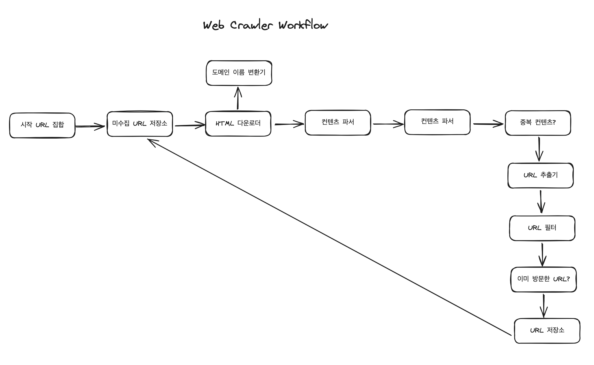

# 웹 크롤러 설계

## 웹 크롤러 작업 흐름


- `시작 URL 집합`
  - 크롤링을 시작하는 출발 지점 
- `미수집 URL 저장소`
  - 다운로드할 URL을 저장관리하는 FIFO Queue 형태의 URL 저장소
- `HTML 다운로더`
  - 인터넷에서 웹페이지를 다운로드하는 컴포넌트
- `도메인 이름 변환기`
  - 다운로드 할 URL을 IP 주소로 변환
- `콘텐츠 파서`
  - 다운로드한 웹 페이지 컨텐츠를 parsing 하는 컴포넌트
- `콘텐츠 저장소`
  - HTML 문서를 보관하는 시스템
  - 인기있는 컨텐츠만 메모리에 두고 대부분의 컨텐츠는 디스크에 저장
- `URL 추출기`
  - HTML 컨텐츠를 parsing하여 링크들만 골라내는 역할을 하는 컴포넌트
  - 상대경로를 모두 절대경로로 변환
- `URL 필터`
  - 특정 컨텐츠 타입이나 파일 확장자를 갖는 URL, 접속시 오류가 발생하는 URL, deny list에 포함된 URL을 크롤링 대상에서 제외하는 역할을 하는 컴포넌트
- `URL 저장소`
  - 이미 방문한 URL을 보관하는 저장소

1. 시작 URL 집합들을 모두 미수집 URL 저장소에 저장함
2. HTML 다운로더는 미수집 URL 저장소에서 URL을 가져온 후 도메인 이름 변환기에서 받은 IP 주소에 접속 해 HTML 페이지를 다운로드함
3. 콘텐츠 파서는 HTML 페이지를 파싱하여 페이지가 올바른지 검증함
4. 중복 컨텐츠인지 확인하기 위해 페이지가 이미 저장소에 있는지 확인하고 새로운 컨텐츠라면 저장소에 저장 후 URL 추출기로 전달함
5. URL 추출기는 HTML 페이지에서 링크를 골라내고 필터링을 거친 URL만 중복 URL 판별 단계로 넘어감
6. 중복 URL이 아닌 경우 (=저장소에 없는 URL) 미수집 URL 저장소로 전달됨
7. 2~6 과정 반복 

## politeness를 갖춘 웹 크롤러를 만들기 위해서는?

> 웹 사이트의 hostname과 다운로드를 수행하는 worker thread 사이의 관계를 유지하라!
> 각 다운로드 worker thread가 별도 FIFO Queue를 관리하는 방식

- `Queue Router`
  - 같은 hostname에 속한 URL은 언제나 같은 큐로 가도록 보장하는 역할을 함
- `Mapping Table`
  - hostname : queue를 mapping하는 역할을 함

## URL 우선순위를 고려하게 된다면?
- `Prioritizer`
  - 입력받은 URL에 대한 우선순위를 계산함
  - 우선순위가 높은 Queue가 선택받을 확률이 높아짐
- `큐 선택기`
  - 임의의 큐에서 처리할 URL을 꺼내는 역할을 담당함
  - 순위가 높은 큐에서 더 자주 꺼내도록 프로그램되어 있음

## ChatGPT와 함께 prioritizer가 적용된 polite cralwer를 구현해본다면?

1. Queue groups with different priorities
```ts
class PriorityQueueGroup {
    private groupPriority: number;
    private queues: Map<string, PriorityQueue>;

    constructor(groupPriority: number) {
        this.groupPriority = groupPriority;
        this.queues = new Map();
    }

    addUrl(url: string, priority: number): void {
        const hostname = new URL(url).hostname;
        if (!this.queues.has(hostname)) {
            this.queues.set(hostname, new PriorityQueue());
        }
        this.queues.get(hostname)?.enqueue({ url, priority });
    }

    getNextUrl(): QueueItem | undefined {
        for (let [hostname, queue] of this.queues) {
            if (!queue.isEmpty()) {
                return queue.dequeue();
            }
        }
    }

    isEmpty(): boolean {
        return Array.from(this.queues.values()).every(queue => queue.isEmpty());
    }
}
```

2-1. A mechanism to select queues based on their group priority.
   - group priority + 큐 내부의 URL priority를 고려해 URL 선택 
2-2. Respect politeness by implementing a delay between requests to the same hostname.

```ts
class PoliteCrawler {
    private priorityGroups: Map<number, PriorityQueueGroup> = new Map();
    private lastAccess: Map<string, number> = new Map();
    private crawlDelay: number = 1000; // Default crawl delay of 1 second

    addUrl(url: string, priority: number, groupPriority: number): void {
        if (!this.priorityGroups.has(groupPriority)) {
            this.priorityGroups.set(groupPriority, new PriorityQueueGroup(groupPriority));
        }
        this.priorityGroups.get(groupPriority)?.addUrl(url, priority);
    }

    async crawl(): Promise<void> {
        const sortedGroups = Array.from(this.priorityGroups.entries())
                                  .sort((a, b) => a[0] - b[0]); // Sort by group priority

        while (sortedGroups.some(([_, group]) => !group.isEmpty())) {
            for (let [groupPriority, group] of sortedGroups) {
                const item = group.getNextUrl();
                if (item) {
                    const now = Date.now();
                    const hostname = new URL(item.url).hostname;

                    // Respect crawl delay
                    const lastAccessTime = this.lastAccess.get(hostname) || 0;
                    if (now - lastAccessTime < this.crawlDelay) {
                        await new Promise(resolve => setTimeout(resolve, this.crawlDelay - (now - lastAccessTime)));
                    }

                    console.log(`Crawling URL: ${item.url} with group priority: ${groupPriority}`);
                    this.lastAccess.set(hostname, Date.now());

                    // Here, insert logic for making the HTTP request and handling the response.

                    // Break to give other groups a chance in a round-robin fashion
                    break;
                }
            }
        }
    }
}
```

3. implement priority assignment
```ts
// Define content types and their associated priorities
enum ContentType {
    HomePage = 1,
    Article = 2,
    ProductPage = 3,
    Other = 4
}

// Simplified function to determine content type from a URL
function determineContentType(url: string): ContentType {
    if (url.endsWith('/')) return ContentType.HomePage;
    else if (url.includes('/articles/')) return ContentType.Article;
    else if (url.includes('/product/')) return ContentType.ProductPage;
    else return ContentType.Other;
}

// Simplified function to determine URL depth
function determineUrlDepth(url: string): number {
    const path = new URL(url).pathname;
    return path.split('/').filter(Boolean).length; // Filter Boolean removes empty segments
}

// Example function to assign group and individual priorities based on hypothetical criteria
function assignPriorities(url: string): [number, number] { // Returns [groupPriority, urlPriority]
    const hostname = new URL(url).hostname;
    let groupPriority: number;
    let urlPriority: number;

    // Assign group priority based on domain relevance (simplified example)
    switch (hostname) {
        case 'highpriority.com':
            groupPriority = 1;
            break;
        case 'mediumpriority.com':
            groupPriority = 2;
            break;
        default:
            groupPriority = 3;
            break;
    }

    // Determine individual URL priority
    const contentType = determineContentType(url);
    const depth = determineUrlDepth(url);

    // Combine content type and depth for URL priority (simplistic approach)
    urlPriority = contentType + depth;

    return [groupPriority, urlPriority];
}
```
4. demo
```ts
async function main() {
    const crawler = new PoliteCrawler();

    const urls = [
        "http://highpriority.com/",
        "http://highpriority.com/articles/new-approaches",
        "http://mediumpriority.com/product/12345",
        "http://lowpriority.com/about"
    ];

    for (const url of urls) {
        const [groupPriority, urlPriority] = assignPriorities(url);
        crawler.addUrl(url, urlPriority, groupPriority);
    }

    await crawler.crawl();
}

main();
```
