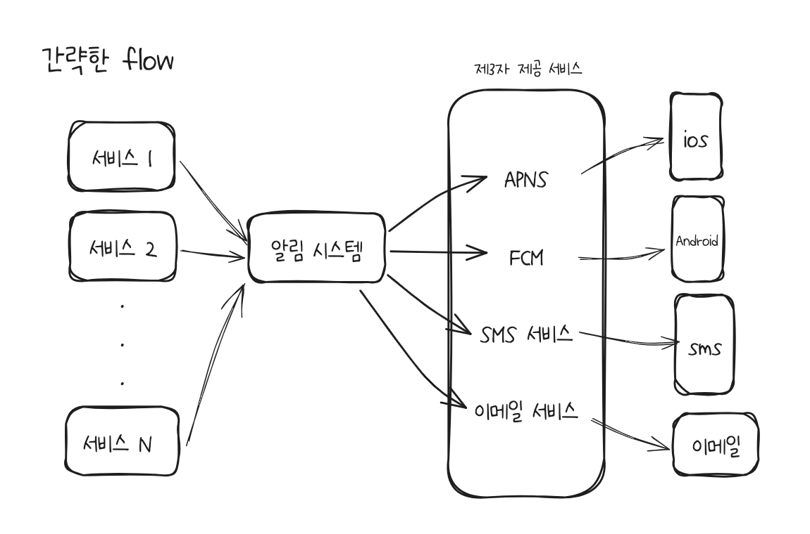
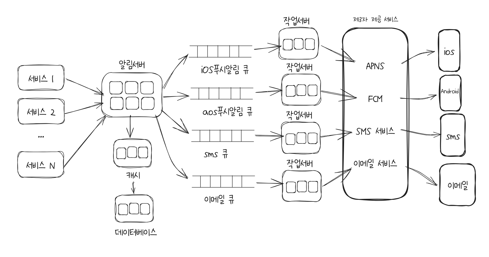
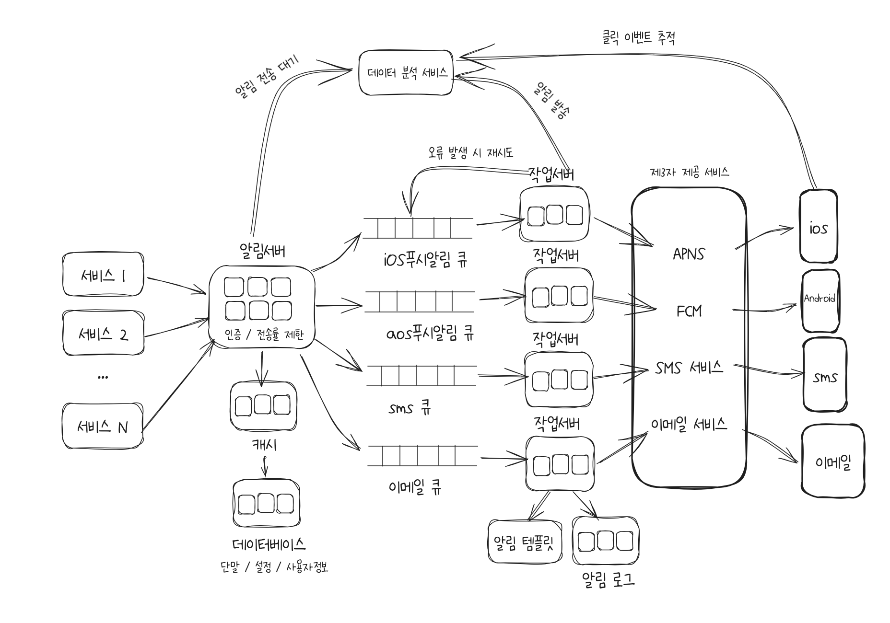

# 10장. 알림 시스템 설계

- 알림 시스템 종류
  - 모바일 푸시 알림
  - SMS 메시지
  - 이메일

## 1단계 문제 이해 및 설계 범위 확정

- Q1. 알림 종류?
  - 푸시 알림, SMS 메시지, 이메일
- Q2. 실시간(real-time) 시스템 여부?
  - 연성 실시간(soft real-time) 시스템 -> 시스템 과부하시에는 약간 지연되도 괜찮다
- Q3. 지원 가능한 단말?
  - iOS, android, 랩톱/데스크톱
- Q4. 사용자에게 보낼 알림은 누가 만드나?
  1.  클라 애플리케이션 프로그램이 만들거나
  2.  서버에서 스케줄링
- Q5. 사용자가 알림을 받지 않도록(opt-out) 설정할 수 있는가?
  - 예
- Q6. 하루에 몇 건의 알림을 보낼 수 있어야 하는가?
  - 모바일 푸시 알림 - 1000만 건
  - SMS 메시지 - 100만 건
  - 이메일 - 500만 건

## 2단계 개략적 설계안 제시 및 동의 구하기

### 알림 유형별 지원 방안

- iOS 푸시 알림
  - 알림 제공자(provider) -> APNs -> iOS 단말
  - 알림 제공자가 알림 요청(notification request)을 만들어 APNs로 보내면 APNs가 iOS 장치로 푸시 알림을 보냄
  - APNs란?
    - Apple Push Notification Service
    - 애플이 제공하는 원격 서비스
- 안드로이드 푸시 알림
  - 알림제공자 -> FCM -> 안드로이드 단말
  - FCM이란?
    - Firebase Cloud Messaging
- SMS 메시지
  - 알림제공자 -> SMS 서비스 -> SMS 수신 단말
  - 트윌리오(Twilio), 넥스모(Nexmo)와 같은 제3 사업자 서비스 주로 이용
    - (👀우리나라도?)
  - 이용요금 발생
- 이메일
  - 알림제공자 -> 이메일 서비스 -> 이메일 수신 단말
  - 대부분 회사의 고유 이메일 서버 구축
  - 그럼에도 상용 이메일 서비스는? 센드그리드(Sendgrid), 메일침프(Mailchimp)

### 연락처 정보 수집 절차

- 알림을 보내려면 모바일 단말 토큰, 전화번호, 이메일 주소 등이 필요함
- 어떻게 수집?
  - 처음 회원가입 때 입력받아 DB에 저장한다
- 이때, 한 사용자가 여러 단말을 가질 수 있고, 알림은 모든 단말에 전송되어야 한다는 점을 고려해야한다!!
  (책에서는 Device라는 스키마를 따로 파서 관리, User 스키마와는 분리)

### 알림 전송 및 수신 절차

- 간략 설계

  - 
  - 서비스 1~ N : 마이크로 서비스 또는 크론잡, 분산 시스템 컴포넌트 일수도 있다
  - 알림시스템 : 서비스 1~ N에 알림 전송을 위한 API를 제공, 제3자 서비스에 전달할 알림 페이로드를 만들수 있어야 함
  - 제 3자 서비스: 사용자들에게 알림을 실제로 전달하는 역할
    - 확장성 중요 - 쉽게 새로운 서비스를 통합하거나 기존 서비스를 제거할 수 있어야 함

- 서버 한대 문제점

  - SPOF
  - 규모 확장성 - 데이터베이스나 캐시 등 중요 컴포넌트를 개별적으로 늘리기 어려움
  - 성능 병목 - 트래픽 많으면 시스템 과부하

- 개선 - 데이터베이스, 캐시를 알림시스템 주 서버에서 분리 - 알림 서버 증설, 자동으로 수평적 규모 확장되도록 - 메시지 큐 이용 - > 시스템 컴포넌트의 사이의 강한 결합을 끊는다
  

- 알림 서버 기능
  - 알림 전송 API
  - 알림 검증 - 이메일 주소, 전화번호 등 기본 검증
  - 데이터베이스 또는 캐시 질의
  - 알림 전송 - 알림 데이터를 메시지 큐에 넣는다 -> 알림을 병렬적으로 처리
- 캐시 - 사용자 정보, 단말 정보, 알림 템플릿 캐시
- 데이터베이스 - 사용자 알림, 설정 등의 정보 저장
- 메시지 큐 - 시스템 간 의존성 제거를 위해 사용, 버퍼 역할
- 작업 서버 - 메시지 큐에서 전송할 알림을 꺼내 third-party service로 전달

### 알림 전송 flow (ex. iOS)

API 호출해서 알림 전송 -> 알림 서버가 캐시나 db 조회하여 사용자 정보, 단말 토큰, 알림 설정 등을 조회 -> 알림 이벤트를 iOS 푸시 알림 큐에 push -> 작업 서버가 큐를 pop 하여 알림 이벤트를 APNS로 전달 -> APNS에서 iOS 사용자 단말로 알림 전송!

## 3단계 상세설계

### 안정성

- 데이터 손실 방지
  - 어떻게?
    - 알림 데이터를 **데이터 베이스에 보관**하고 **재시도 메커니즘**을 구현해야한다!
    - 알림 로그(Notification Log)데이터베이스를 유지한다
- 알림 중복 전송 방지
  - 분산 시스템 특성상 가끔 같은 알림이 중복 전송된다
  - 중복을 탐지하는 메커니즘 도입이 필요하다
    - 보내야 할 알림이 도착하면 그 이벤트 ID를 검사하여 이전에 본 적이 있는 이벤트인지 살핀다. 중복된 이벤트면 버리고 아니면 알림 발송

### 추가로 필요한 컴포넌트 및 고려사항

- 알림 템플릿
- 알림 설정 - ex) 알림 받을 채널, 알림 opt-out 여부 등
- 전송률 제한 - 알림 빈도 제한
- 재시도 방법 - 일림 실패 시 알림 재시도 전용 큐에 추가, 계속 실패하면 개발자에게 noti
- 푸시 알림과 보안
- 큐 모니터링 - 큐에 쌓인 알림의 개수를 모니터링해서 갯수가 많아지면 서버 증설
- 이벤트 추적 - ex) 실제로 보낸 알림이 효용이 있는지 체크

### 수정된 설계안

