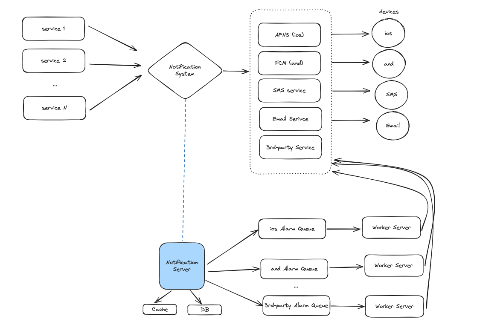

# 알림 시스템 설계

## 알림 전송 및 수신 절차

- `서비스 1-N`: 사용자에게 알림을 보내야 하는 서비스
  - ex. microservice, cronjob, 분산 시스템 컴포넌트, 과금 서비스 등
- `알림 시스템`: 알림 전송/수신의 핵심 처리부
  - 알림 기능을 사용하는 서비스에게 알림 전송 API 제공 (수신)
  - 3자 서비스에 전달할 알림 payload 생성 기능 (전송)
    - ex. 단말 토큰, 알림 내용, 전화번호, 이메일 주소 등
- `제 3자 서비스`: 알림을 사용자에게 전달하는 역할을 하는 서비스
  - 알림 수신 단말 종류에 따라 사용하는 서비스 종류가 다르기 때문에 확장성을 고려해야 함
- `ios, and, SMS, email 단말`

- 현재 설계의 문제점
  - SPOF(Single-Point-Of-Failure): 서버가 한대여서 서버의 장애가 시스템 장애로 이어짐
  - 규모 확장성: 알람 전송/수신과 관련한 모든 처리를 한대의 서버에서 처리하기 때문에 중요 컴포넌트(ex. DB, Cache)를 개별적으로 늘릴 수 없음

## 개선안
1. DB와 Cache를 알림 서버에서 분리
 -  사용자 정보, 단말 정보, 알림 템플릿과 같이 meta payload를 만들 때 자주 사용되는 정보는 Cache에 저장
 -  사용자, 알림, 설정 등 다양한 정보를 DB에 저장
2. 알림 서버에 대한 수평적 규모 확장이 가능하도록 알림 데이터를 메시지 큐에 넣어서 처리
3. 시스템 컴포넌트 간의 의존성 제거 및 다량의 알림 전송을 대비한 버퍼 역할을 위해 메시지 큐를 사용 
4. 작업 서버는 메시지 큐에서 전송할 알림을 꺼내서 제 3자 서비스로 전달하는 역할

## 추가 고려사항

- `데이터 손실 방지`
  - 알림 로그 DB를 생성하여 모든 알림 데이터 기록을 저장함
- `알림 중복 전송 방지`
  - 분산 시스템 상에서 알림이 중복으로 발송되는 경우가 있음
    - ex. 슬랙봇 서버 pod가 gs, pg에 2개 띄워져 있는데 등록해놓은 cronjob이 2번 실행되는 이슈가 있음
  - 해결방법: 보내야 할 알림이 도착하면 이벤트 ID를 검사해 알림 발송을 했던적이 있는지 확인하는 절차를 거침
- `알림 템플릿`
  - 알림 메시지의 데이터 부분만 parameter로 처리하여 템플릿 생성 후 알림 발송을 하는데 활용
  - 일관된 알림 메시지를 사용자에게 제공할 수 있는 이점이 있음
- `알림 설정`
  - 사용자가 알림 설정을 커스텀하게 할 수 있도록 다양한 옵션 제공
- `전송률 제한`
  - 사용자가 알림을 받을 수 있는 빈도수를 제한
- `실패한 알림 전송에 대한 재시도`
  - 실패한 알림을 재시도 전용 큐에 넣어서 관리
  - 큐 threshold를 넘으면 alert이 가도록 설정
- `큐 모니터링`
  - 큐에 쌓인 알림의 개수를 모니터링하여 작업 서버 증설 여부를 판단
- `이벤트 추적`
  - 알림 시스템을 데이터 분석 서비스와 통합하여 알림 확인율, 클릭율, 실제 앱 사용으로 이어지는 비율 등을 체크
