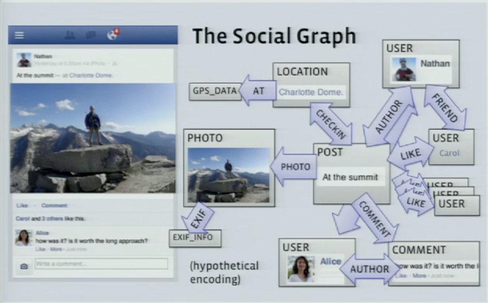
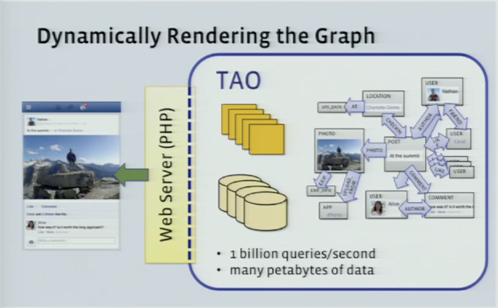
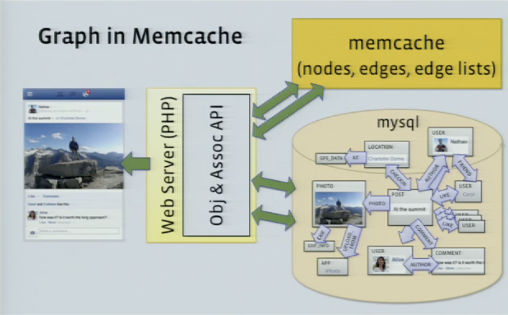
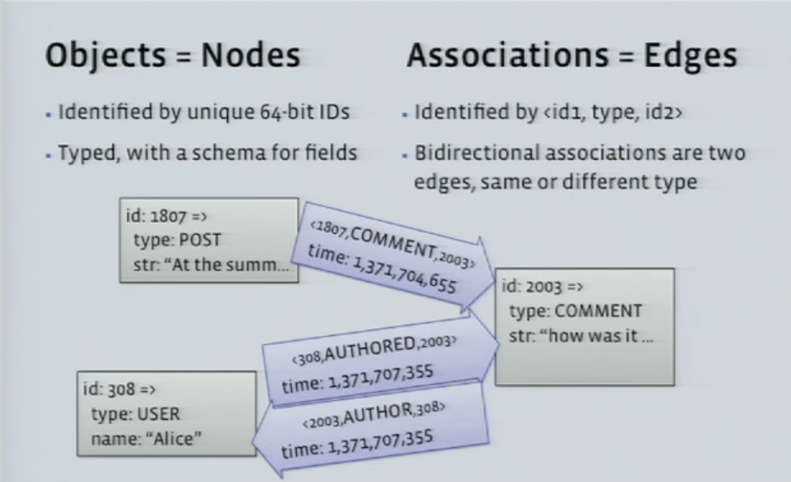
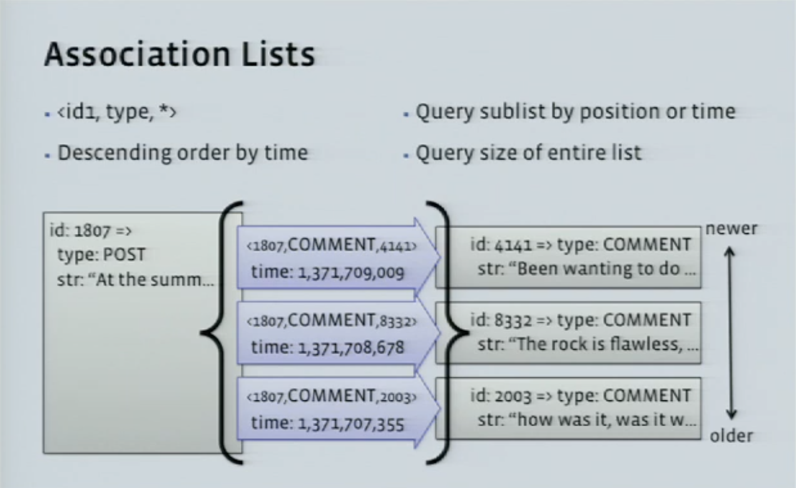

# 11장. 뉴스 피드 시스템 설계

뉴스 피드 시스템 - 인스타, 페북 같은 것!

- 여기서 뉴스 피드(news feed)란? 팔로우하는 사람들의 포스팅 목록

## 1단계 문제 이해 및 설계 범위

- 지원범위 - 모바일, 웹 둘다
- 주요 기능
  - 새로운 포스팅 올리기
  - 친구들이 올리는 포스팅 보기
- 정렬 - 시간 흐름 역순 (최신순)
- 한명의 사용자가 가질 수 있는 최대 친구 수 - 5000명
- 트래픽 규모 - 매일 천만명
- 미디어 파일 포함 여부 - ㅇ (이미지, 비디오)

## 2단계 개략적 설계안 제시 및 동의 구하기

- 설계안 큰 틀
  1.  피드 발행 (feed publishing)
      - 사용자가 새로운 포스팅을 올리면 해당 데이터가 캐시와 데이터베이스에 기록되고, 친구 뉴스 피드에도 전송된다.
  2.  뉴스 피드 생성 (news feed building)
      - 모든 친구의 포스팅을 최신순으로 모아서 만든다

### 뉴스 피드 API

- 피드 발행 : `POST /v1/me/feed`
  - body- 포스팅 내용
  - Authorization 헤더 - 인증에 사용
- 피드 읽기 : `GET /v1/me/feed` **(👀배열 형태?)**
  - Authorization 헤더

### 피드 발행

- 사용자가 새로운 포스팅을 올리면 (`POST /v1/me/feed`) 일어나는 일
  1.  포스팅 저장 => **포스팅 저장 서비스**
      - 포스팅은 포스팅 캐시와 데이터베이스에 기록
  2.  포스팅 전송 - 새 포스팅을 친구의 뉴스 피드에 전송 (push) => **포스팅 전송 서비스**
      - 뉴스 피드 데이터는 피드 캐시에 보관된다
  3.  친구한테 푸쉬 알림 => **알림 서비스**

### 뉴스 피드 생성

- 사용자가 뉴스 피드를 읽으면 (`GET /v1/me/feed`) 일어나는 일
  1.  캐시에서 뉴스 피드를 가져온다 => **뉴스 피드 서비스**
      - 뉴스 피드 캐시 - 뉴스 피드를 렌더링할 때 필요한 피드 ID 보관

## 3단계 상세 설계

### 피드 발행 흐름 상세 설계

#### 웹 서버

- 클라이언트와 통신
- 인증, 처리율 제한 기능 수행
  - 스팸 방지 & 특정기간 동안 올릴 수 있는 포스팅 수 제한

#### 포스팅 전송(팬아웃) 서비스

- fanout: 사용자가 업로드한 새 포스팅을 그 사용자의 모든 친구들에게 전달하는 과정

- 쓰기 시점에 팬아웃 (push 모델) - 포스팅을 기록하는 시점에 친구의 피드 갱신

  - 장점
    - 뉴스 피드가 **실시간**으로 갱신
    - 포스트를 읽을 때는 이미 뉴스 피드가 갱신되어 있으므로 **빠르게 읽을 수 있다**
  - 단점
    - **핫키(hotkey)** : 친구가 많은 사용자라면 팬아웃 시간이 오래 걸린다
    - 서비스를 자주 이용하지 않는 사용자 피드까지 갱신해야하므로 컴퓨팅 **자원이 낭비**된다

- 읽기 시점에 팬아웃 (full 모델) - 피드를 읽어야 할 시점에 뉴스피드 갱신 (on-demand 모델)

  - 장점
    - 비활성화된 사용자는 피드 갱신을 안하므로 자원이 절약된다
    - 핫키 문제도 x
  - 단점
    - 피드르 읽어 오는데 오래걸릴 수 있다

- 따라서 이 두가지 방법을 결합!

  - 대부분의 사용자는 푸시 모델을 사용하고, 연예인은 풀 모델을 사용하여 시스템 과부하 방지
  - - 안정 해시 -> 서버 부하 분산 -> 핫키 문제 줄이기

- 팬아웃 동작
  1.  친구 목록을 가져온다
      - 일부 사용자 필터링 (ex. 내 피드 업데이트를 mute한 사용자, 친한 친구공개)
  2.  친구 목록과 새 포스팅 ID를 메시지 큐에 넣는다
  3.  팬아웃 작업 서버가 메시지 큐에서 데이터를 꺼내 뉴스 피드 데이터를 뉴스 피드 캐시에 넣는다.
      - 뉴스 피드 캐시 : <포스팅 ID, 사용자 ID> (매핑 테이블)

### 피드 읽기 흐름 상세 설계

1. 사용자가 피드 읽기 요청 전송 (`GET /v1/me/feed`)
2. 로드밸런서가 요청을 웹서버 가운데로 전송
3. 웹서버는 피드를 가져오기 위해 뉴스 피드 서비스 호출
4. 뉴스 피드 서비스는 캐시에서 포스팅 ID 목록 가져옴 (user_id, post_id)
5. 뉴스 표시에 사용할 사용자 정보(이름, 프로필 사진), 포스팅 정보(콘텐츠, 이미지)를 각각 사용자 캐시와 포스팅 캐시에서 가져와 완전한 뉴스 피드를 만듦
6. 생성된 뉴스 피드를 JSON 형태로 클라이언트로 전송 -> 클라이언트가 피드 랜더링

#### 캐시 구조

- 다섯 계층을 나눈 캐시
  - 뉴스 피드 - 뉴스 피드
  - 콘텐츠 - 인기 콘텐츠, 일반 콘텐츠
  - 소셜 그래프 - 팔로어, 팔로잉
  - 행동(action) - 좋아요, 답글
  - 횟수(counter) - 좋아요 수, 답글 수

---

## TAO: Facebook's Distributed Data Store for the Social Graph

- https://www.youtube.com/watch?v=sNIvHttFjdI

- TAO

  - The Associations and Objects
  - Social Graph를 저장하고 이에 대한 엑세스를 제공하는 시스템

- Social Graph
  

- TAO's Goals/Challenges
  - Efficiency at scale
  - Low read latency
  - Timeliness of writes
  - High Read Availability

