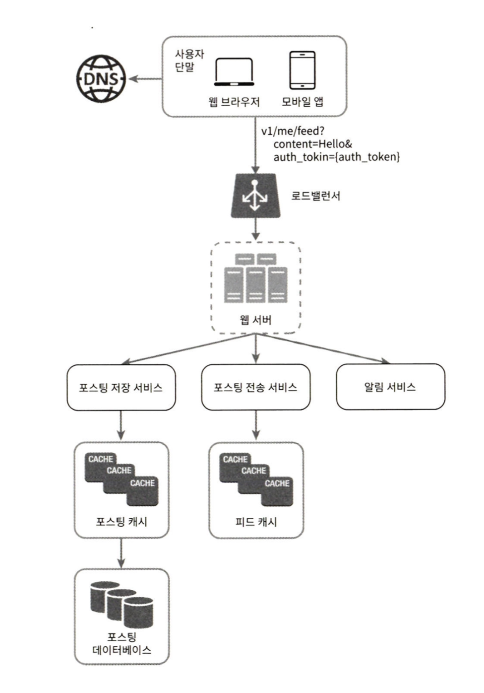
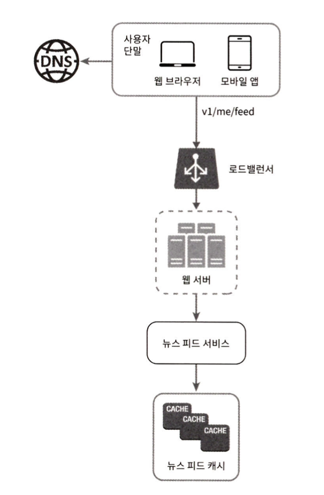
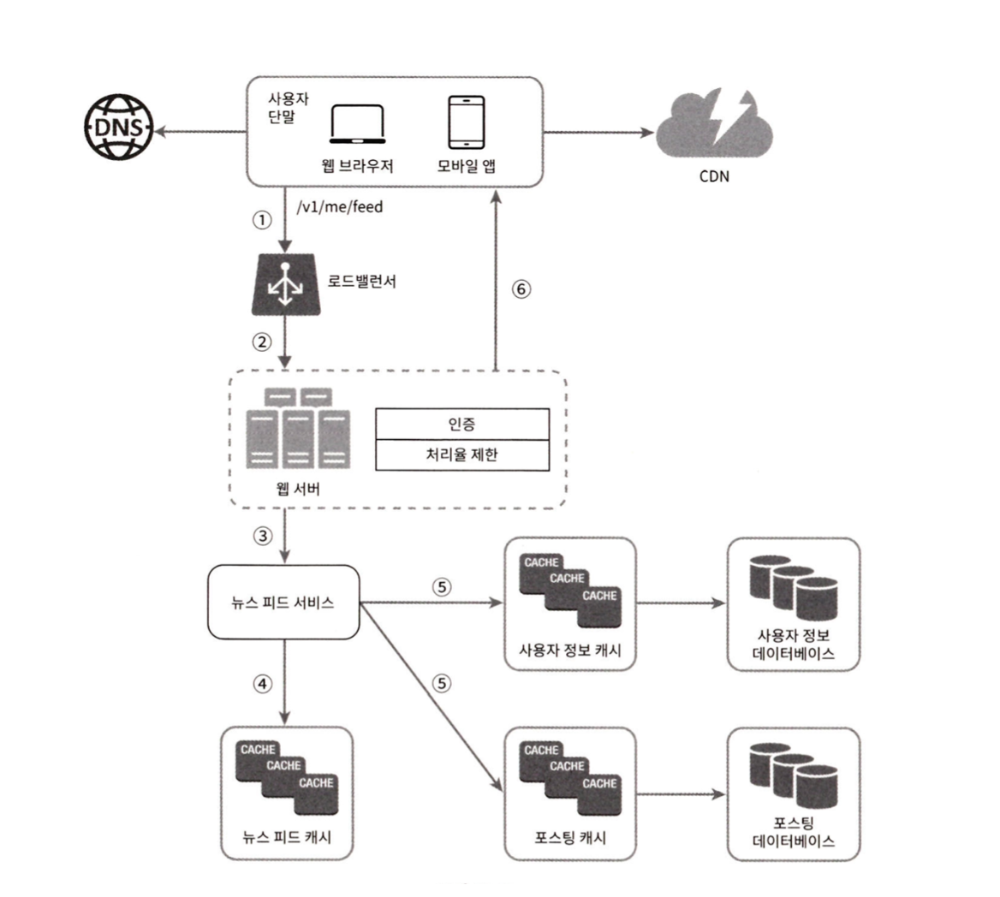

# 뉴스 피드 시스템 설계

### 1단계: 문제 범위 확정
- 모바일? 웹? 둘다? 어느 것을 지원해야하는가?
    - 둘 다 지원
- 핵심 기능은 무엇인가?
    - 피드 발행 및 조회
- 피드 표시 순서의 조건이 있는가?
    - 최신 포스트? 점수에 따른 정렬? (가까운 친구의 포스트가 더 우선, 좋아요 수 등)
- 트래픽 규모는 어떻게 되는가?
    - 매일 천만 명이 방문

### 2단계: 개략적 설계

#### 피드 발행
1. 사용자가 POST 메소드를 통해 피드 발행 요청
2. 로드밸런서를 통해 웹 서버로 라우팅 (Reverse Proxy)
3. 웹 서버에서 비지니스 로직 처리 (피드 저장, 피드 전송, 알림)

#### 피드 생성
1. 사용자가 GET 메소드를 통해 피드 정보 요청
2. 로드밸런서를 통해 웹 서버로 라우팅
3. 웹 서버에서 처리 (캐시에서 피드 데이터 가져옴)

### 3단계: 상세 설계

#### 포스팅 전송(팬아웃) 서비스
팬아웃(fanout)은 어떤 사용자의 새 포스팅을 그 사용자와 친구 관계에 있는 모든 사용자에게 전달하는 과정

두 가지 모델 존재

- 쓰기 시점에 팬아웃(fanout-on-write)하는 푸시 모델
    - 장점
        - 뉴스피드가 실시간으로 갱신되며 친구 목록에 있는 사용자에게 즉시 전송된다.
        - 새 포스팅이 기록되는 순간에 뉴스 피드가 이미 갱신되므로 피드 읽는데 드는 시간 감소
    - 단점
        - 친구가 많은 사용자의 경우 친구 목록을 가져오고 그 목록에 있는 사용자 모두의 뉴스 피드를 갱신하는 데 많은 시간이 소요될 수 도 있다. (핫키(hotkey) 문제)
        - 서비스를 자주 이용하지 않는 사용자의 피드까지 갱신해야 하므로 컴퓨팅 자원이 낭비

- 읽기 시점에 팬아웃(fanout-on-read)하는 풀 모델
    - 장점
        - 비활성화된 사용자, 또는 서비스에 거의 로그인하지 않는 사용자의 경우에는 이 모델이 유리하다. 로그인하기까지는 어떤 컴퓨팅 자원도 소모하지 않는다.
        - 데이터를 친구 각각에 푸시하는 작업이 필요 없으므로 핫키 문제도 생기지 않는다.
    - 단점
         - 뉴스피드를 읽는 데 많은 시간이 소요
        

#### 피드 조회 동작 흐름

1. 사용자가 뉴스 피드를 읽으려는 GET 요청을 보낸다. 요청은 "/v1/me/feed" 로 전송
2. 로드밸런서가 요청을 웹 서버 가운데 하나로 부하 분산
3. 웹 서버는 피드를 가져오기 위해 뉴스 피드 서비스를 호출
4. 뉴스 피드 서비스는 뉴스 피드 캐시에서 포스팅 ID 목록을 조회
5. 뉴스 피드에 표시할 사용자 이름, 사용자 사진, 포스팅 콘텐츠, 이미지 등을 사용자 캐시와 포스팅 캐시에서 가져와 완전한 뉴스 피드 생성
6. 생성된 뉴스 피드를 JSON 형태로 클라이언트에 전송하고, 클라이언트는 해당 피드를 렌더링

