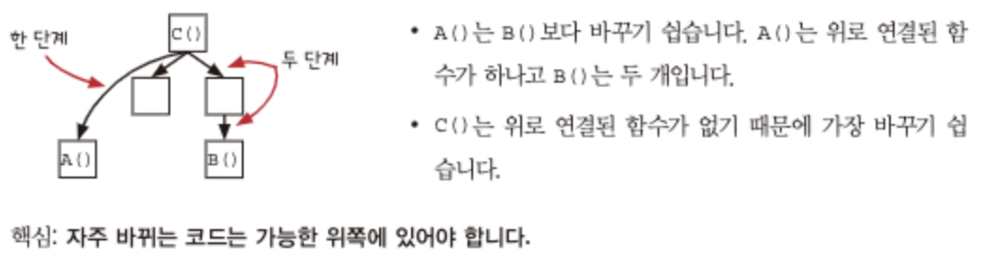
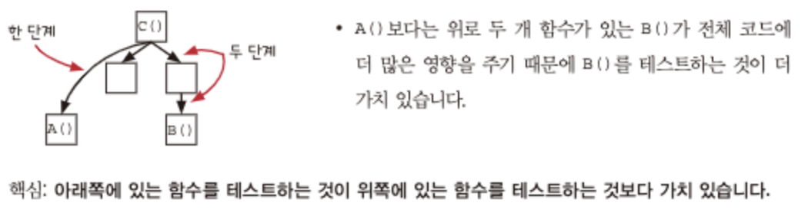
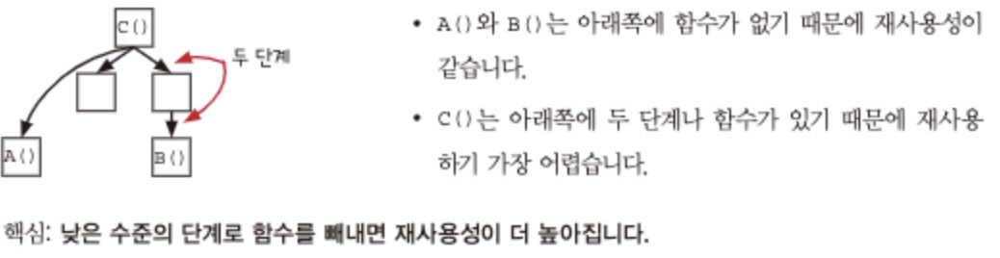

# 계층형 설계

## 패턴 1: 직접 구현

서로 다른 추상화 수준을 비슷한 추상화 수준으로 맞추기.

```typescript
function freeTieClip(cart) {
  var hasTie = false;
  var hasTieClip = false;
  for (var i = 0; i < cart.length; i++) {
    var item = cart[i];
    if (item.name === "tie") {
      hasTie = true;
    }
    if (item.name === "tie clip") {
      hasTieClip = true;
    }
    if (hasTie && !hasTieClip) {
      var tieClip = make_item("tie clip", 0);
      return add_item(cart, tieClip);
    }
    return cart;
  }
}
```

```typescript
function freeTieClip(cart) {
  var hasTie = isInCart(cart, "tie");
  var hasTieClip = isInCard(cart, "tie clip");

  if (hasTie && !hasTieClip) {
    var tieClip = make_item("tie clip", 0);
    return add_item(cart, tieClip);
  }
  return cart;
}

function isInCart(cart, name) {
  for (var i = 0; i < cart.length; i++) {
    if (cart[i].name === name) {
      return true;
    }
  }
  return false;
}
```

## 패턴 2: 추상화 벽

고수준의 API를 제공하여 내부 구현에 대해 신경쓸 필요 없게 하기.

## 패턴 3: 작은 인터페이스

상위 계층에 함수를 만들 때 가능한 현재 계층에 있는 함수를 재사용하는 것이 작은 인터페이스를 유지할 수 있는 방법.

## 패턴 4: 편리한 계층

..? 지금 현재도 편리하다고 느끼면 설계를 멈추고 코드가 지저분해지고 있다고 느껴질 때 패턴을 적용해라.

# 호출 그래프

호출 그래프를 그리면 구조를 한 눈에 파악하기 쉽고, 함수들의 변경에 따른 영향도를 예상하기 쉽다.

1. 유지보수성

- 호출 그래프 상단에 위치할수록 변경하기 쉽다.
  

2. 테스트 가능성

- 호출 그래프 하단에 위치한 함수일수록 영향 범위가 더 크기 때문에 테스트하는 것이 더 가치가 있다.
  

3. 재사용성

- 호출 그래프 하단에 위치한 함수일수록 더 재사용하기 좋다. (dependency가 적기 때문에)
  

### ETC

특정 함수 선택하면 이거와 관련된 호출 그래프 그려주는 tool은 없나..?

# 일급 함수 Part 1

## 리팩터링: 암묵적 인자를 드러내기

```typescript
function setFieldByName(cart, name, field, value) {
  var item = cart(name);
  var newItem = objectSet(item, field, value);
  var newCart = objectSet(cart, name, newItems);
  return newCart;
}

// as-is
setPriceByName(cart, name, price);
setQuantityByName(cart, name, price);
setShippingByName(cart, name, price);
setTaxByName(cart, name, price);

// to-be
setFieldByName(cart, "shoe", "price", 13);
setFieldByName(cart, "shoe", "quantity", 3);
setFieldByName(cart, "shoe", "shipping", 0);
setFieldByName(cart, "shoe", "tax", 2.34);

// typescript ver
function setFieldByName<T extends CartFieldEnum>(
  cart: Cart,
  name: string,
  field: T,
  value: CartFieldValueType[T]
) {
  // ...
}
```
