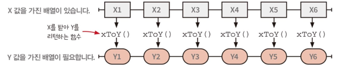
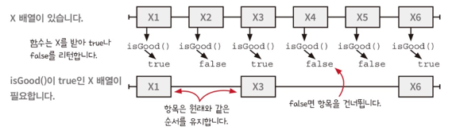
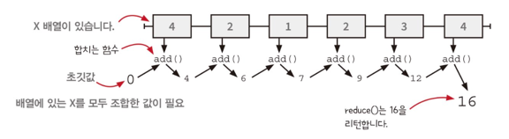
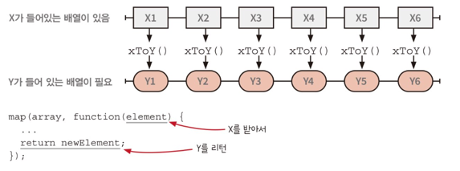
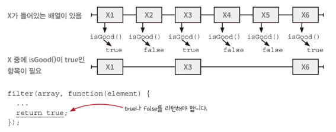
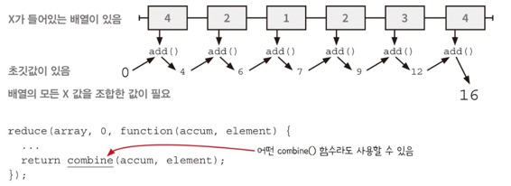

## Chapter 12

- 코드의 냄새 : 함수 이름에 있는 암묵적 인자
- 리팩터링1 : 암묵적 인자를 드러내기
- 리팩터링2 : 함수 본문을 콜백으로 바꾸기
  - 본문과앞부분, 뒷부분을 확인하기
  - 함수 빼내기
  - 콜백 빼내기

### map()

- 배열의 각 요소에 대해 주어진 함수를 호출하고, 그 함수의 반환 값으로 이루어진 새로운 배열을 생성함.
- 기존 배열을 변경하지 않고 새로운 배열을 반환.
- 배열 전체를 리턴하기 때문에 null이나 undefined가 들어 있을 수 있음
  - `filter(v => !!v)`



> 함수를 전달하는 방법
> 1. 전역으로 정의하기
> 2. 지역으로 정의하기 - 지역으로 쓰고싶지만 이름이 필요할 때
> 3. 인라인으로 정의하기(익명 함수) - 문맥에서 한 번만 쓰는 짧은 함수에 사용


### filter()

- 항목이 X인 배열에 X를 받아 boolean 타입을 리턴하는 함수를 전달해 true인 항목만 유지하여 배열을 리턴하는 함수
- `술어(predicate)` : true 또는 false를 리턴하는 함수. filter()나 다른 고차 함수에 전달하기 좋다





### reduce()

- 배열의 모든 요소를 하나로 합치거나 조작하는 데 사용됨.
- 전달 받은 함수와 배열 요소를 하나씩 순회하며 초기 값에서 시작하여 누적된 결과를 반환한.




- 배열 내의 숫자를 더하는 함수

```jsx
function sumArray(numbers) {
  const result = numbers.reduce((accumulator, currentValue) => accumulator + currentValue, 0);
  return result;
}

const numbersToAdd = [1, 2, 3, 4, 5];
const sum = sumArray(numbersToAdd);
console.log(sum); // 출력 결과: 15
```

- 배열 내의 숫자를 곱하는 함수

```jsx
function multiplyArray(numbers) {
  const result = numbers.reduce((accumulator, currentValue) => accumulator * currentValue, 1);
  return result;
}

const numbersToMultiply = [1, 2, 3, 4, 5];
const product = multiplyArray(numbersToMultiply);
console.log(product); // 출력 결과: 120
```

> reduce()로 할 수 있는 것들
> - 실행 취소/실행 복귀
> - 테스트할 때 사용자 입력을 다시 실행하기
> - 시간 여행 디버깅
> - 회계 감사 추적

경험 있는 분..?

- reduce()로 filter()과 map() 만들기

### 총정리

- `map()` : 어떤 배열의 모든 항목에 함수를 적용해 새로운 배열로 바꿈



- `filter()` : 어떤 배열의 하위 집합을 선택해 새로운 배열로 만듦



- `reduce()` : 어떤 배열의 항목을 조합해 최종값을 만듦




## Chapter 13


