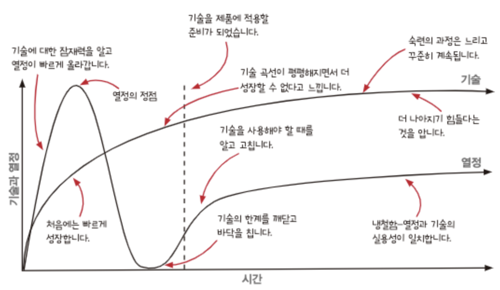

# 함수형 프로그래밍 여행에 앞서

## 액션과 계산, 데이터

- 액션에서 계산을 빼내어 재사용하기 좋고 테스트하기 쉬운 코드를 만들자
- 암묵적 입력과 출력을 명시적인 것으로 바꾸어 액션의 설계를 개선
- 불변성을 활용해 함수를 계산으로 만듬

## 일급 추상

- 언어의 문법을 일급으로 만들어 코드를 추상화
- 함수형 도구를 연결해 데이터 변환 파이프라인을 만들 수 있음
- 타임라인 다이어그램을 통해 시간 흐름에 따라 코드가 어떻게 실행되는지 시각화 할 수 있음
- 고차함수로 데이터를 안전하게 변경
- 반응형 아키텍처를 활용해 원인과 효과의 결합을 줄일 수 있음

## 시간에 따른 기술과 열정의 변화

- 기술:
  1. 빠르게 기술에 대해서 습득하고 성장
  2. 어느정도 배웠을 때부터 성장이 더뎌짐
  3. 숙련의 과정은 느리지만 꾸준히 지속됨 (deep dive 단계?)
- 열정:
  1. 기술에 대해 알게된 후 여기저기 기술을 적용하며 열정 급상승
  2. 기술의 한계에 대해 알게되고 추락
  3. 상승과 추락을 통해 기술을 언제 도입해야 하고, 어떤 경우에 도입하지 말아야 할 지 알게됨
  4. 숙달된 경험을 통해 실용성에 따라 기술을 도입

## 기술을 습득하기 위한 방법 2가지

### 트랙 1

즐겁게 기술을 연습하고 실험하는 방식

- 연습 문제로 연습
- 사이드 프로젝트를 통해
- 제품 코드에서 버려진 브랜치를 활용

### 트랙 2

냉정하게 봤을 때 기술이 익숙해진 것 같다는 생각이 들 때, 좋은 코딩 습관을 가지고 실제 프로젝트에 적용해나가는 방식

- 이미 있는 코드를 리팩토링
- 이미 있는 프로젝트의 새로운 기능에 적용
- 새로 만든 제품에 적용
- 다른 사람을 가르치기
