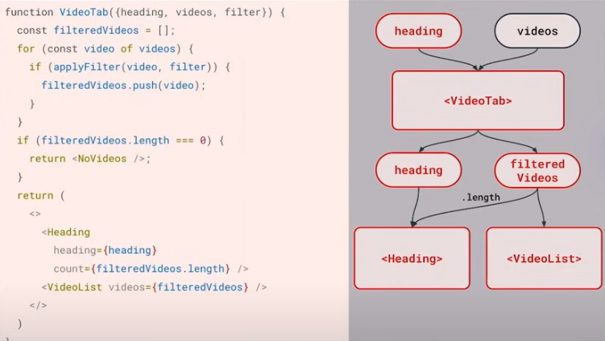
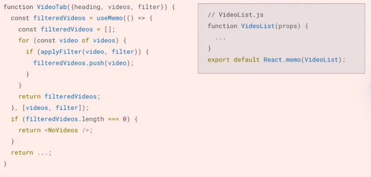
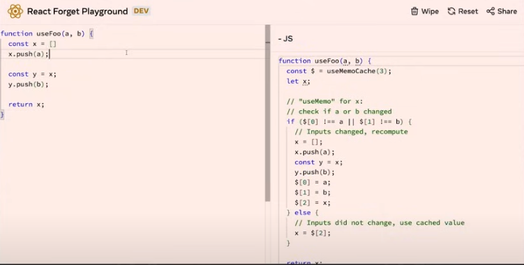
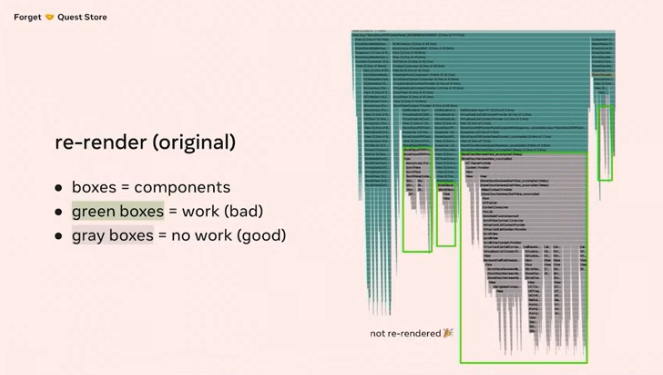
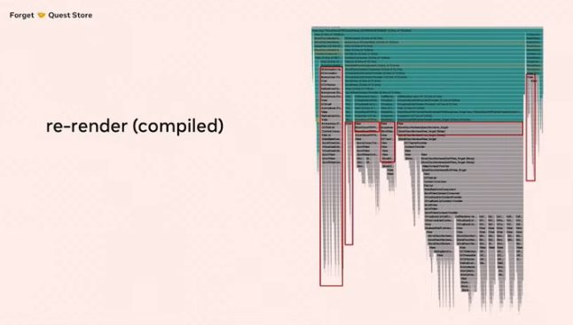

# React 19

## React Compiler (React Forget)

- https://react.dev/blog/2023/03/22/react-labs-what-we-have-been-working-on-march-2023#react-optimizing-compiler
- https://react.dev/blog/2024/02/15/react-labs-what-we-have-been-working-on-february-2024#react-compiler

---

- 리액트 상태가 많아질수록 랜더링이 너무 많이 되는 경우가 생김
  - 이를 방지하기 위해 현재는 `useMemo`, `useCallback`, `memo` api를 사용해서 개발자가 손수 최적화를 신경쓰고 있는 중이다.
  - 그런데 이렇게 하면 코드도 지저분하고, 휴먼 에러가 발생할수도 있음
- 리액트는 요런걸 자동으로 해주는 것이 목표임
- React Compiler는 현재 [instagram.com](http://instagram.com/)에 적용되어 있음 (더 이상 실험 단계가 아님!)

---

https://www.youtube.com/watch?v=qOQClO3g8-Y

1. React forget이 나오게 된 이유?

- 기존 코드의 문제
  - heading 값이 바뀐 경우 `<Heading/>` 만 리렌더링 되기를 바라지만, `<Heading/>` `<VideoList/>` 둘다 리렌더링 됨. filteredVideos를 다시 만드는 것도 불필요함.



- 개선 - useMemo, memo 사용하기 (Manual memoization)
  - 성능은 좋아지지만 개발자가 일일이 신경써줘야해서 번거로움



- 개선 2
  - 요걸 React가 자동으로 해준다면!? 이걸 런타임이 아닌 **빌드(컴파일) 시점**에 해준다면!?
  - ⇒ React Forget’s Goal

2. React Forget

- 내부 테스트 사이트
  - useMemoCache를 사용해서 이전 값과 비교를 함
  - 만약 값이 바뀌면 로직 실행, 값이 동일하면 캐시 값을 사용한다.



3. How does React Forget work?

- React Forget은 React를 위해 설계된 low-level compiler
  - rules of js와 rules of react를 모두 이해하고 있음
  - input: 이전 AST → output: 새로운 AST

4. demo (with Quest Store)

- before
  - green boxes - rerender 되는 부분



- after
  - 불필요한 렌더링 감소!
  - 리랜더링이 빨라짐



---

https://reacttraining.com/blog/react-19-will-be-compiled

https://velog.io/@lky5697/how-react-forget-will-make-react-usememo-and-usecallback-hooks-absolutely-redundant

## Actions

- Server Actions - client에서 server로 데이터를 보내는 방법
  - sending data to client to server? https://react.dev/blog/2023/03/22/react-labs-what-we-have-been-working-on-march-2023#react-server-components
  - RPC (Remote Procedure Call) ([참고](https://jins-dev.tistory.com/entry/RPC-Remote-Procedure-Call-의-개념))
- Actions - Server Action을 확장해서 client-only 앱에서도 사용할 수 있게 함
  - DOM 요소에 함수를 넘길수 있게 해준다. ex) `form`
  ```jsx
  <form action={search}>
    <input name="quer" />
    <button type="submit">Search</button>
  </form>
  ```
- 동기 또는 비동기로 동작
- 그래서 액션을 왜 쓰는데?
  - 액션 사용 예시
    - [useFormState](https://react.dev/reference/react-dom/hooks/useFormStatus#usage) - React가 제출하는 데이터의 life cycle을 관리 함
    - [codesandbox](https://codesandbox.io/p/sandbox/zen-shannon-sdgy2s?file=%2Fsrc%2FApp.js&utm_medium=sandpack)
  - 액션은 transition 중에 제출됨 (UI 블로킹 없이)
  - async/await 사용 → pending UI 보여줄수 있음
    - [useOptimistic](https://react.dev/reference/react/useOptimistic) - > client에서 data의 최종 상태를 최적화할 수 있음 (or 이전 데이터로 되돌리기)
  - `<Calendar onSelect={eventHandler}>` → `<Calendar selectAction={action}>`

## Asset Loading

- 현재 `Suspense`는 패칭되는 데이터가 준비되기까지를 기다리고 있는데,
- 앞으로 stylesheet, font, image 등 화면을 그리기 위해 필요한 asset이 준비될 때까지 기다리는 기능이 생길것이다.

## Document Metadata

기존에 메타 태그를 다루기 위한 방법

1. head 태그 내부에 title, meta를 포함한 third-party component를 렌더링 한다.
   - 하지만, 이걸 적용할 수 없는 브라우저가 꽤 있음
2. SSR
   - main content render → head render → client로 전송
   - head를 전달받기 전까지 모든 ssr 과정을 기다려야 함 → streaming server rendering의 이점을 취할 수 없음

react가 이를 해결하려는 방향

- metadata 다루는 것을 built-in으로 제공하겠다
