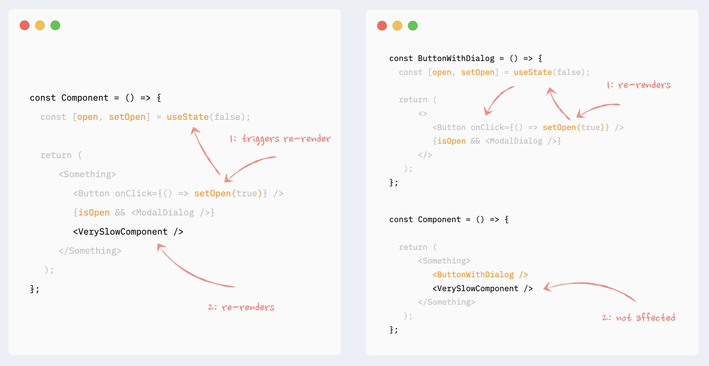
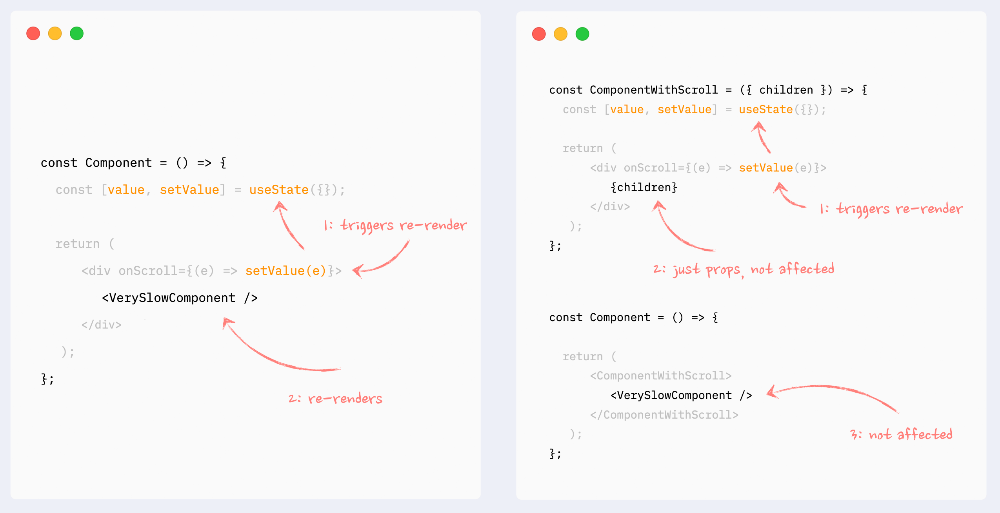
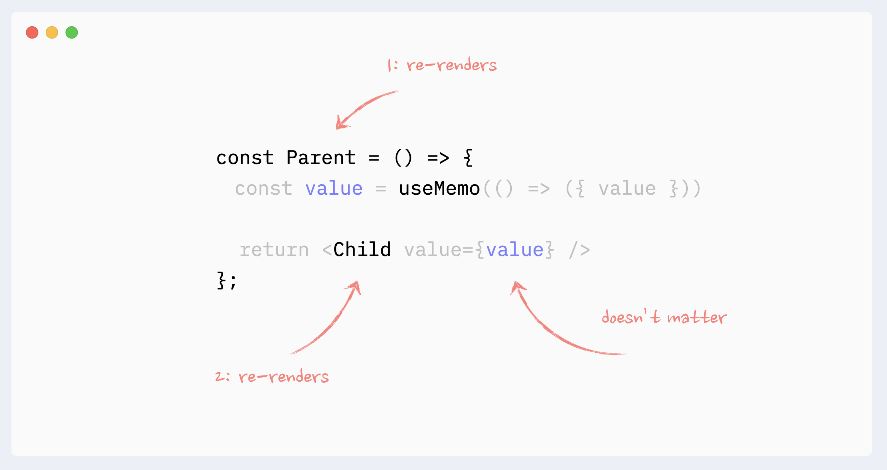
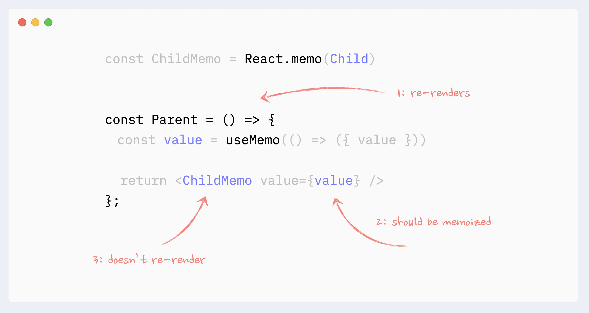

## React Compiler (React Forget)

> Manual memoization is a reasonable compromise, but we weren’t satisfied.
> Our vision is for React to automatically re-render just the right parts of the UI when state changes, without compromising on React’s core mental model.

```
React 19 !== Compiler
Compiler comes next after React 19

- useMemo, useCallback, memo -> React Compiler
- forwardRef -> ref is a prop
- React.lazy -> RSC, promise-as-child
- useContext -> use(Context)
- throw promise -> use(promise)
```

"아직 컴파일러로 마이그레이션 하지 않은 경우" -------> "이미 컴파일러가 활성화된 경우"
**전환 기간**은 무조건 필요하기 때문에 컴파일러가 출시 됐다고 해서 useMemo, useCallback 다 잊어도 돼! 이렇게 가면 안된다

### 변경 포인트들

- **React Compiler는 리액트 코드를 모든 훅의 종속성, 컴포넌트의 프로퍼티 및 컴포넌트 자체가 메모화된 코드로 변환하는 Babel 플러그인이 될 것 (=everything gets memoized)**
  - Before) 부모가 re-render되면 자식도 모두 다 re-render 되는 구조
  - After) 자식 컴포넌트의 prop이 변경될 때만 re-render 되는 구조
- **성능을 위한 Composition 기법이 더 이상 필요없어지게 될 것** [참고](https://www.developerway.com/posts/react-re-renders-guide#part3.2)

  - 상태를 아래로 이동시키기
    - 
  - 컴포넌트를 자식으로 전달
    - 

- **useMemo, useCallback을 통한 불필요한 re-render 방지도 불필요해질 것**

  - Antipattern 😡
    - 
  - Good pattern 😀
    - 

- **Diffing (비교) & Reconciliation (재조정) 방식이 변화할 것** [참고](https://www.developerway.com/posts/reconciliation-in-react)

  ```jsx
  const ParentComponent = () => {
    const Input = () => <input />;
    return <Input />;
  };
  ```

  - "defining component inside other components"가 anti-pattern이었던 이유
    - `ParentComponent`가 re-render 할 일이 생길 때 마다 `Input`컴포넌트는 매번 remount됨
    - reconciliation의 관점에서 봤을 때 `ParentComponent`는 { type: Input }으로 표현되는데 Input function은 컴포넌트 내부에서 매번 새로 생성되는 함수임
    - 매번 새롭게 생성되는 함수에 대한 비교는 false일 수밖에 없기 때문에 `Input` 컴포넌트가 매번 remount되는 것임

  ```js
  // React 관점에서의 비교
  const a = () => {};
  const b = () => {};

  a === b; // will always be false
  ```

## Action

> Extended from Server Actions to support both client and server-side data handling

### 주요 특징들

- `<form />`과 같은 DOM element에 함수 형태로 Action을 넘겨 form data handling 로직을 수행할 수 있도록 함
- Submission Process
  - [transition](https://react.dev/reference/react/useTransition)을 이용해 Action Submission이 이루어져 page interaction을 방해하지 않음
  - 비동기 로직을 처리 가능함
- Optimistic Updates
  - `useOptimistic` 훅을 통해서 optimistic state updates 결과를 받아올 수 있음
- 관련 훅들
  - [useFormStatus](https://react.dev/reference/react-dom/hooks/useFormStatus)
```jsx
import { useFormStatus } from "react-dom";
import { submitForm } from "./action.js";

function Submit() {
  const { pending, data } = useFormStatus();
  return (
    <div>
      <h3>Request a Username: </h3>
      <input type="text" name="username" disabled={pending} />
      <button type="submit" disabled={pending}>
        Submit
      </button>
      <br />
      <p>{data ? `Requesting ${data?.get("username")}...` : ""}</p>
    </div>
  );
}

function Form() {
	return (
		<form action={action}>
			<Submit />
		</form>
	)
}
```
  - [useFormState](https://react.dev/reference/react-dom/hooks/useFormState)
```jsx
import { useFormState } from "react-dom";

async function increment(previousState, formData) {
	return previousState + 1;
}

function Form() {
	const [state, formAction] = useFormState(increment, 0);
	return (
		<form>
			{state}
			<button formAction={formAction}>Increment</button>
		</form>
	)
}
```